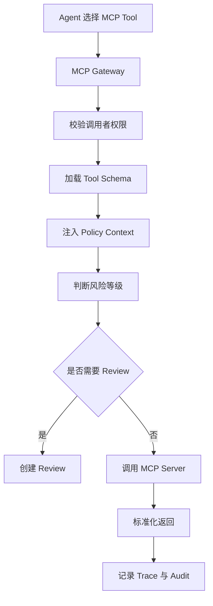
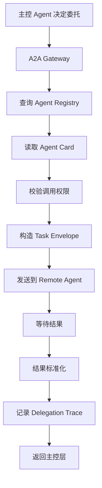

# 新疆能源集团知识与生产经营智能 Agent 平台  
# Agent Mesh 协作架构设计文档

## 1. 文档说明

本文档用于定义 **新疆能源集团知识与生产经营智能 Agent 平台** 的第一期完整 Agent 协作架构。

本架构目标不是只支持当前几个业务场景，而是从第一期开始就具备以下能力：

- 支持多个业务 Agent 的统一编排；
- 支持 MCP 工具协议接入；
- 支持 A2A Agent 协作协议接入；
- 支持未来持续新增 Agent；
- 支持跨团队、跨系统、跨服务的 Agent 协作；
- 支持统一权限、安全、审计、Human Review 和评估体系；
- 支持“当前集中式落地 + 未来服务化拆分”的平滑演进。

本文档重点回答以下问题：

1. 什么是本项目中的 Multi-Agent；
2. MCP 在本项目中的定位是什么；
3. A2A 在本项目中的定位是什么；
4. 为什么第一期就要设计 Agent Mesh；
5. 如何做到“首期架构一步到位，但实现可分阶段推进”；
6. 如何为未来持续接入新的 Agent 打好基础。

---

## 2. 设计目标

本架构设计目标如下：

### 2.1 目标一：第一期就具备完整协作边界

第一期必须明确以下边界：

- 主控编排层和业务 Agent 的边界；
- Agent 和 Tool 的边界；
- MCP Tool 和 A2A Agent 的边界；
- 本地能力和远程能力的边界；
- 权限、风险、审计、评估的治理边界。

### 2.2 目标二：支持未来不断新增 Agent

未来新增的 Agent 可能包括：

- 新能源调度 Agent
- 设备预测性维护 Agent
- 供应链风控 Agent
- 公文写作 Agent
- 领导驾驶舱 Agent
- 财务分析 Agent
- 采购审批 Agent
- 培训考试 Agent
- 外部厂商提供的专用 Agent

因此第一期必须支持：

- Agent 注册
- Agent 能力描述
- Agent 任务契约
- Agent 调用授权
- Agent 结果标准化
- Agent Trace 追踪
- Agent 评估

### 2.3 目标三：支持当前部署形态与未来服务化形态统一

第一期落地时，部分 Agent 可以仍然在同一套服务中以“本地 Agent 模块”方式存在。

但从架构上必须支持未来演进为：

- 独立部署的远程 Agent；
- 第三方团队维护的 Agent；
- 通过 A2A 协议接入的外部 Agent；
- 通过 MCP 协议接入的能力服务。

### 2.4 目标四：保证企业级安全和可治理性

所有 Agent 协作必须满足：

- 权限前置
- 风险前置
- 可中断
- 可人工复核
- 可审计
- 可回放
- 可评估
- 可降级
- 可熔断

---

## 3. 核心设计思想

本项目采用以下 Agent 架构思想：

### 3.1 Workflow-first

Agent 不是自由聊天机器人，而是受控工作流执行体。

所有复杂任务都必须由工作流驱动，包括：

- 路由
- 检索
- 工具调用
- 远程委托
- 风险判断
- 人工审核
- 结果汇总
- 追踪与评估

### 3.2 Tool-first

Agent 负责理解、决策、编排，不直接承担所有执行逻辑。

执行逻辑优先交给工具或能力服务处理，例如：

- RAG 检索工具
- SQL 安全查询工具
- 合同解析工具
- 报告导出工具
- 外部系统接入工具

### 3.3 Evidence-first

Agent 输出必须尽可能基于证据、可引用、可追溯，而不是纯生成。

### 3.4 Human-in-the-loop

高风险任务必须允许人工介入。

### 3.5 Governance-first

Agent 系统不是只追求能跑，而是必须可控、可审计、可评估、可优化。

### 3.6 Protocol-ready

第一期就要为未来的 MCP、A2A、远程 Agent 服务化做好协议级准备。

---

## 4. 整体架构总览

### 4.1 总体分层

本项目的 Agent 协作架构分为以下八层：

1. Interaction Layer：交互层
2. Access & Policy Layer：接入与策略层
3. Agent Control Plane：主控编排层
4. Agent Mesh Layer：智能体协作层
5. Capability Fabric Layer：能力织物层
6. Knowledge & Data Plane：知识与数据平面
7. Governance Plane：治理平面
8. Runtime & Infra Layer：运行时与基础设施层

### 4.2 总体架构图

```mermaid
flowchart TD
    USER[用户 / 管理员 / 审核人] --> FE[交互层 Frontend Workbench]

    FE --> API[API Gateway / Access Layer]

    API --> IDCTX[Identity Context Service]
    API --> POLICY[Policy Engine]
    API --> RISK[Risk Engine]
    API --> REVIEWGATE[Review Gate]

    API --> CONTROL[Agent Control Plane]

    CONTROL --> ROUTER[Task Router]
    CONTROL --> WF[Workflow Engine]
    CONTROL --> STATE[State Store]
    CONTROL --> DELEGATE[Delegation Controller]
    CONTROL --> TRACECORR[Trace Correlator]
    CONTROL --> AGG[Result Aggregator]

    CONTROL --> MESH[Agent Mesh Layer]

    MESH --> POLICY_AGENT[Policy Agent]
    MESH --> SAFETY_AGENT[Safety Agent]
    MESH --> EQUIP_AGENT[Equipment Agent]
    MESH --> ENERGY_AGENT[EnergyOps Agent]
    MESH --> CONTRACT_AGENT[Contract Agent]
    MESH --> ANALYTICS_AGENT[Analytics Agent]
    MESH --> PROJECT_AGENT[Project Agent]
    MESH --> REPORT_AGENT[Report Agent]

    MESH --> A2A[A2A Gateway]
    A2A --> AGENT_REG[Agent Registry]
    A2A --> AGENT_CARD[Agent Card / Capability Profile]
    A2A --> REMOTE_AGENTS[Remote Agents]

    CONTROL --> FABRIC[Capability Fabric]

    FABRIC --> LOCALTOOLS[Local Tools]
    FABRIC --> MCPGW[MCP Gateway]
    FABRIC --> REMOTEAGCAP[Remote Agent Capability Adapter]

    MCPGW --> SQL_MCP[SQL MCP Server]
    MCPGW --> FILE_MCP[File MCP Server]
    MCPGW --> API_MCP[Enterprise API MCP Server]
    MCPGW --> REPORT_MCP[Report Export MCP Server]

    LOCALTOOLS --> RAG_TOOL[RAG Retrieval Tool]
    LOCALTOOLS --> REVIEW_TOOL[Review Tool]
    LOCALTOOLS --> TRACE_TOOL[Trace Tool]
    LOCALTOOLS --> CONTRACT_TOOL[Contract Local Tool]

    FABRIC --> KNOWLEDGE[Knowledge & Data Plane]
    KNOWLEDGE --> MILVUS[Milvus]
    KNOWLEDGE --> POSTGRES[PostgreSQL]
    KNOWLEDGE --> REDIS[Redis]
    KNOWLEDGE --> CELERY[Celery Workers]
    KNOWLEDGE --> BIZDB[Business Databases]
    KNOWLEDGE --> OBJECT[Object Storage]

    CONTROL --> GOV[Governance Plane]
    GOV --> REVIEW[Human Review Service]
    GOV --> TRACE[Trace & Audit]
    GOV --> EVAL[Evaluation]
    GOV --> OBS[Observability]
    GOV --> POLICYLOG[Policy Logs]
```



---

## 5. Agent Control Plane 设计

Agent Control Plane 是整个系统的主控中枢。

### 5.1 核心职责

负责：

- 接收任务；
- 识别任务类型；
- 决定采用哪种执行路径；
- 决定使用本地 Agent、MCP Tool 还是远程 Agent；
- 保存与恢复状态；
- 管理 Human Review；
- 统一记录 Trace；
- 汇总输出结果。

### 5.2 核心模块

#### 5.2.1 Task Router

负责识别任务属于哪种业务域，例如：

- policy_qa
- safety_qa
- equipment_qa
- new_energy_ops_qa
- contract_review
- business_analysis
- project_qa
- report_generation
- multi_step_composite_task
- remote_agent_delegation

#### 5.2.2 Workflow Engine

负责执行状态机和工作流，包括：

- 节点执行
- 条件分支
- 错误重试
- 长流程状态恢复
- Human Review 中断和恢复
- 本地/远程执行切换

#### 5.2.3 Delegation Controller

负责决定是否将任务委托给其他 Agent 或能力服务。

主要判断：

- 当前任务是否适合本地解决；
- 当前任务是否需要 MCP Tool；
- 当前任务是否更适合远程业务 Agent；
- 当前任务是否需要多个 Agent 协作；
- 当前任务是否需要结果再汇总。

#### 5.2.4 State Store

保存运行过程中的状态，至少包括：

- run_id
- task_id
- parent_task_id
- route
- current_step
- selected_agent
- selected_tools
- selected_remote_agent
- risk_level
- review_status
- context_snapshot
- output_snapshot
- retry_count
- status

#### 5.2.5 Trace Correlator

负责把以下执行链路串起来：

- 用户请求
- 主控 Agent
- 本地 Agent
- Tool 调用
- MCP 调用
- A2A 调用
- SQL 审计
- Human Review
- 最终输出

---

## 6. Agent Mesh Layer 设计

Agent Mesh Layer 用于组织多个业务 Agent。

### 6.1 设计原则

#### 6.1.1 采用“领域型 Multi-Agent”

本项目使用领域型 Agent，而不是角色扮演型 Agent。

推荐 Agent 集合：

- Policy Agent：制度政策 Agent
- Safety Agent：安全生产 Agent
- Equipment Agent：设备检修 Agent
- EnergyOps Agent：新能源运维 Agent
- Contract Agent：合同审查 Agent
- Analytics Agent：经营分析 Agent
- Project Agent：项目资料 Agent
- Report Agent：报告生成 Agent

#### 6.1.2 每个 Agent 必须有明确边界

每个 Agent 都必须定义：

- 它处理什么问题；
- 它不处理什么问题；
- 它可访问哪些知识库；
- 它可调用哪些工具；
- 它可委托哪些远程 Agent；
- 它输出什么格式；
- 它有哪些风险级别；
- 它怎么评估效果。

#### 6.1.3 本地 Agent 与远程 Agent 统一抽象

无论当前是本地模块还是未来远程服务，主控层都应该把它视为“Agent Capability”。

### 6.2 Agent 能力描述（Agent Card）

每个 Agent 必须注册 Agent Card。

示例：

```json
{
  "agent_id": "analytics_agent",
  "name": "经营分析 Agent",
  "description": "负责经营指标理解、SQL 分析、结果解释和经营报告生成",
  "domain": "business_analysis",
  "capabilities": [
    "understand_business_question",
    "generate_sql",
    "analyze_sql_result",
    "generate_business_report"
  ],
  "accepted_task_types": [
    "business_analysis",
    "metric_analysis",
    "trend_analysis"
  ],
  "allowed_tools": [
    "sql_mcp.execute_safe_sql",
    "rag_search",
    "report_generate"
  ],
  "allowed_kbs": [
    "operation_analysis_kb"
  ],
  "output_schema": "BusinessAnalysisResult",
  "risk_profile": {
    "default_risk_level": "medium",
    "requires_review_on_sensitive_data": true
  },
  "owner_team": "AI Platform Team",
  "version": "v1"
}
```

### 6.3 Agent Registry

Agent Registry 负责统一登记所有 Agent。

#### 6.3.1 注册对象

包括：

- 本地 Agent
- 远程 Agent
- 第三方 Agent
- 实验性 Agent
- 待下线 Agent

#### 6.3.2 核心字段

- agent_id
- agent_type（local / remote / external）
- endpoint
- protocol（internal / a2a）
- agent_card
- status
- owner_team
- health_status
- created_at
- updated_at

#### 6.3.3 核心作用

- 能力发现
- 调用合法性校验
- 路由候选筛选
- Agent 升级与版本控制
- 下线控制
- 健康检查

---

## 7. Capability Fabric 设计

Capability Fabric 是整个系统的能力织物层，统一承载一切“可执行能力”。

### 7.1 为什么引入 Capability Fabric

因为执行能力来源可能不同：

- 本地工具
- MCP Tool
- 远程 Agent
- 未来其他协议能力

如果没有统一抽象，主控层会越来越耦合。

### 7.2 能力分类

#### 7.2.1 Local Tool

本地工具，运行在当前系统内部。

例如：

- rag_search
- rerank
- create_human_review
- record_trace
- local_contract_parser

#### 7.2.2 MCP Tool

通过 MCP 协议接入的远程工具能力。

例如：

- sql_mcp.execute_safe_sql
- file_mcp.read_file
- enterprise_api_mcp.query_system
- report_mcp.export_pdf

#### 7.2.3 Remote Agent Capability

通过 A2A 协议接入的远程 Agent 能力。

例如：

- remote_analytics_agent
- remote_contract_agent
- remote_energy_ops_agent

### 7.3 能力统一元数据

所有 Capability 应统一描述为：

- capability_id
- capability_type（local_tool / mcp_tool / remote_agent）
- name
- description
- input_schema
- output_schema
- required_permission
- risk_level
- timeout
- retry_policy
- audit_enabled
- human_review_required
- owner
- protocol

这样主控层只需要面向 Capability 调度，不需要关心底层来源。

---

## 8. MCP Gateway 设计

### 8.1 MCP 的定位

MCP 在本项目中的定位是：

> 统一接入外部工具和能力服务的协议层。

### 8.2 MCP 适合接入哪些能力

本项目推荐优先 MCP 化的能力包括：

- SQL 安全查询能力
- 文件读写与报表导出能力
- 企业业务系统查询能力
- 邮件草稿能力
- 工单草稿能力
- 外部知识系统能力

### 8.3 SQL MCP Server 设计

这是最优先建议做的 MCP Server。

#### 8.3.1 作用

负责：

- get_allowed_schema
- list_accessible_tables
- get_table_metadata
- get_metric_definition
- execute_safe_sql

#### 8.3.2 为什么 SQL 适合做 MCP

因为 SQL 能力具有：

- 高风险
- 高复用
- 安全边界清晰
- 可独立治理
- 可服务化部署
- 可被多个 Agent 复用

#### 8.3.3 边界

Analytics Agent 负责：

- 理解问题
- 选择分析路径
- 组织 SQL 查询任务
- 解释结果
- 生成结论

SQL MCP Server 负责：

- 数据库访问
- SQL 安全校验
- 只读执行
- 表字段权限控制
- 审计记录

### 8.4 MCP Gateway 的核心职责

MCP Gateway 负责：

- MCP Server 发现
- 工具能力注册
- 参数校验
- 权限注入
- 风险级别判断
- 统一审计
- 超时与重试
- 错误标准化

#### 8.4.1 调用流程



---

## 9. A2A Gateway 设计

### 9.1 A2A 的定位

A2A 在本项目中的定位是：

> 让一个 Agent 能够把任务标准化地委托给另一个 Agent。

### 9.2 A2A 适合什么场景

适合：

- 某业务 Agent 已独立部署；
- 某 Agent 由其他团队维护；
- 某 Agent 被多个系统复用；
- 某 Agent 具有完整业务闭环；
- 某 Agent 需要以智能体而不是工具的形式协作。

### 9.3 A2A 不适合什么场景

不适合：

- 简单函数调用；
- 简单数据查询；
- 简单文件读取；
- 单步工具执行；
- 本地普通工具替代场景。

这类更适合 Tool / MCP Tool，而不是 A2A。

### 9.4 A2A Gateway 的核心职责

A2A Gateway 负责：

- 远程 Agent 发现
- Agent Card 获取
- 任务信封构造
- 任务委托
- 结果接收
- 超时与重试
- 失败降级
- 委托链 Trace
- 调用审计

#### 9.4.1 A2A 调用流程



---

## 10. Task Envelope 统一任务契约

为了让本地 Agent、MCP Tool、A2A Agent 协作统一，必须定义统一任务契约。

### 10.1 任务信封示例

```json
{
  "task_id": "task_001",
  "parent_task_id": "task_root_001",
  "run_id": "run_001",
  "trace_id": "trace_001",
  "task_type": "business_analysis",
  "initiator": {
    "user_id": "u_001",
    "role": "business_analyst",
    "department": "经营管理部"
  },
  "target": {
    "target_type": "remote_agent",
    "target_name": "analytics_agent"
  },
  "input": {
    "question": "分析本月煤炭销售收入下降原因"
  },
  "policy_context": {
    "allowed_tables": ["coal_sales_monthly"],
    "allowed_fields": ["month", "sales_amount", "mine_name"]
  },
  "risk_context": {
    "risk_level": "medium",
    "requires_review": false
  },
  "deadline": "2026-05-01T12:00:00Z",
  "idempotency_key": "task_001_idem"
}
```

### 10.2 必须包含的字段

- task_id
- parent_task_id
- run_id
- trace_id
- task_type
- initiator
- target
- input
- policy_context
- risk_context
- deadline
- idempotency_key

---

## 11. Result Contract 统一结果契约

### 11.1 返回结果示例

```json
{
  "task_id": "task_001",
  "status": "success",
  "output": {
    "summary": "本月煤炭销售收入下降主要受销量下降和均价波动影响"
  },
  "evidence": [
    {
      "type": "sql_result",
      "source": "coal_sales_monthly"
    }
  ],
  "citations": [],
  "risk_level": "medium",
  "requires_review": false,
  "errors": [],
  "metrics": {
    "latency_ms": 1250
  }
}
```

### 11.2 必须包含的字段

- task_id
- status
- output
- evidence
- citations
- risk_level
- requires_review
- errors
- metrics

---

## 12. Access & Policy Layer 设计

第一期最完善架构必须把策略层单独设计出来。

### 12.1 Identity Context Service

负责生成统一身份上下文：

- user_id
- role
- department
- allowed_kbs
- allowed_tools
- allowed_agents
- allowed_tables
- allowed_fields
- trace_scope
- review_scope

### 12.2 Policy Engine

负责判断：

- 某用户能不能调某 Agent；
- 某 Agent 能不能调某 MCP Tool；
- 某 Agent 能不能调某远程 Agent；
- 某查询是否越权；
- 某任务是否必须人工复核。

### 12.3 Risk Engine

统一识别风险：

- 安全生产高风险
- 合同重大风险
- 敏感经营数据
- 外部系统写操作
- 正式发布类输出

### 12.4 Review Hook

在以下节点提供中断能力：

- Tool 调用前
- 远程 Agent 委托前
- 高风险答案返回前
- 报告导出前
- 邮件发送前
- 工单提交前

---

## 13. Governance Plane 设计

### 13.1 Human Review

必须支持：

- review_id
- run_id
- task_id
- agent_id
- capability_id
- risk_level
- review_status
- reviewer_id
- review_comment
- created_at
- reviewed_at

### 13.2 Trace & Audit

必须统一记录：

- run_id
- trace_id
- task_id
- parent_task_id
- agent_id
- capability_type
- capability_name
- mcp_server
- remote_agent
- latency_ms
- tokens
- cost
- policy_decision
- risk_decision
- review_id
- status
- error_message

### 13.3 Evaluation

不仅评估 RAG，还要评估：

- Route Accuracy
- Delegation Accuracy
- MCP Call Success Rate
- A2A Call Success Rate
- Review Trigger Accuracy
- SQL Safety
- Contract Risk Recall
- End-to-End Task Success Rate

### 13.4 Policy Logs

必须可追溯：

- 为什么某用户不能调用某能力；
- 为什么某 Agent 被拒绝调用远程 Agent；
- 为什么某任务触发了 Review；
- 为什么某 SQL 被拦截。

---

## 14. Runtime & Infra Layer 设计

### 14.1 本地运行形态

首期可以采用：

- 主服务统一部署
- 本地 Agent 以内嵌模块形式存在
- MCP Server 以独立服务形式优先落地 SQL Server
- A2A Gateway 支持本地/模拟远程委托

### 14.2 未来演进形态

未来可以演进为：

- 主控编排服务独立部署
- 每个复杂业务 Agent 独立服务化
- MCP 工具服务独立扩缩容
- Agent Registry 独立服务
- Review 与治理中心独立服务

---

## 15. 第一阶段推荐落地方式

虽然第一期架构要求最完善，但实现时建议分为“设计到位、能力部分落地”。

### 15.1 第一阶段必须落地的设计对象

必须落地：

- Agent Registry 数据模型
- Agent Card 数据结构
- Task Envelope 数据结构
- Result Contract 数据结构
- Capability Fabric 抽象
- MCP Gateway 接口抽象
- A2A Gateway 接口抽象
- Policy Engine 接口抽象
- Review Hook 接口抽象
- Delegation Trace 数据模型

### 15.2 第一阶段建议先真正实现的能力

建议先实现：

- 本地 Agent Mesh
- SQL MCP Server
- 本地/模拟远程 A2A Gateway
- Agent Registry 静态注册
- Delegation Trace
- Review Hook

### 15.3 第一阶段暂不强求全部独立部署

第一阶段不要求：

- 所有业务 Agent 全部分布式部署；
- 所有 MCP Server 全部分离；
- 所有远程 Agent 真正跨网络服务化；

但必须保证：

- 结构上可拆；
- 协议上可扩；
- 调用契约统一；
- 治理模型统一。

---

## 16. 与现有系统架构的关系

本设计不是推翻现有 `docs/ARCHITECTURE.md`，而是在其基础上升级。

现有架构已经具备：

- Agent 编排层
- 业务 Agent 集合
- 工具调用层
- MCP / 外部工具代理
- Human Review
- Trace 与 Evaluation

本设计在此基础上继续强化：

- Agent Mesh
- Capability Fabric
- MCP Gateway
- A2A Gateway
- Agent Registry
- Agent Card
- Task Envelope
- Result Contract
- Governance Plane

---

## 17. 面试与汇报表达建议

对外汇报时，可用以下表述：

> 本项目第一期即采用 A2A-ready、MCP-ready、Multi-Agent-ready 的企业级 Agent 架构。系统通过 Agent Control Plane 统一编排，通过 Agent Mesh 组织业务智能体，通过 Capability Fabric 统一承载本地工具、MCP 工具和远程 Agent 能力，通过 Policy Engine、Risk Engine、Human Review、Trace 与 Evaluation 建立完整治理体系。这样既能支撑当前业务落地，又为未来持续接入新的 Agent、独立部署业务 Agent、接入第三方 Agent 和工具服务打下了稳定基础。

---

## 18. 当前版本说明

当前文档为 `AGENT_MESH_DESIGN.md v1`，重点完成以下内容：

1. 定义最完善的第一期 Agent 协作架构；
2. 定义 Agent Control Plane；
3. 定义 Agent Mesh；
4. 定义 Capability Fabric；
5. 定义 MCP Gateway；
6. 定义 A2A Gateway；
7. 定义 Agent Registry / Agent Card；
8. 定义 Task Envelope / Result Contract；
9. 定义 Access & Policy Layer；
10. 定义 Governance Plane；
11. 定义首期落地策略与未来演进路径。
