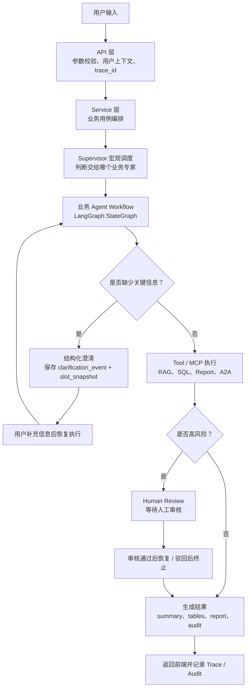
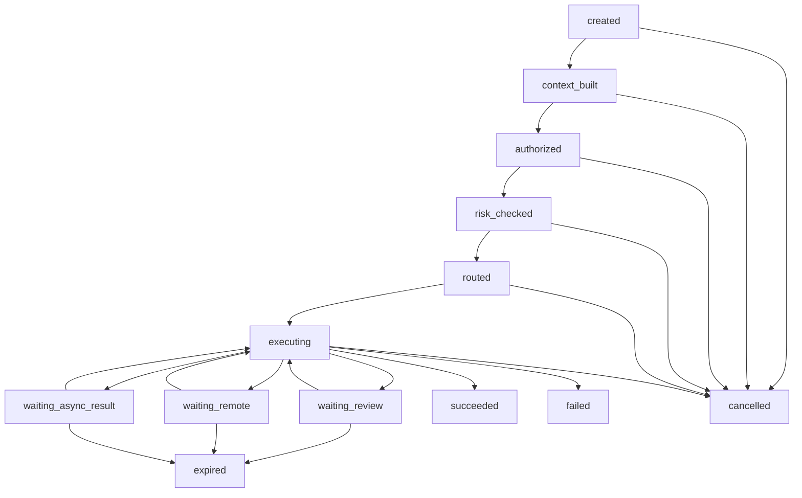
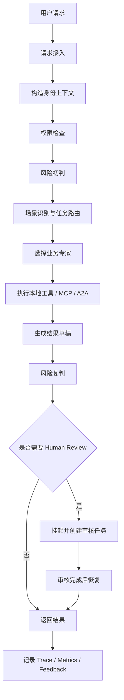
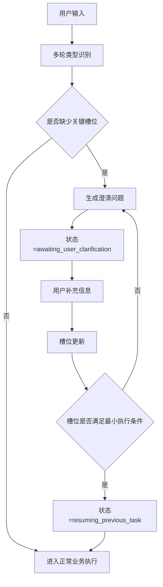

# AGENT_WORKFLOW.md

# 新疆能源集团知识与生产经营智能 Agent 平台
## Agent 工作流设计文档（第一版）

---

## 0. 中文流程总览

如果只想先理解“用户请求到底怎么跑”，可以先看这张图：



中文解释：

- API 不写复杂业务，只负责接请求；
- Service 负责串联业务流程；
- Supervisor 只做宏观调度，不处理业务内部 SQL 细节；
- 业务 Agent 内部由 LangGraph 管节点流转；
- 缺槽位进入澄清，澄清不是失败；
- 高风险进入 Human Review；
- 工具调用必须通过 Tool/MCP/A2A 边界；
- 所有关键动作都要可审计、可恢复。

## 1. 文档定位

本文档是 `ARCHITECTURE.md` 的下位落地设计文档，用于把总架构进一步细化为：

- 可编码的工作流状态机；
- 可实现的节点职责；
- 可落地的异常处理、性能、稳定性、安全、用户体验方案；
- 可审计、可复核、可恢复的执行机制。

本文档重点回答以下问题：

1. 用户请求进入系统后，如何被路由与执行；
2. 智能总指挥台如何调度业务专家团队；
3. MCP / A2A / 本地工具分别在哪些节点接入；
4. Human Review 在什么节点触发、如何中断与恢复；
5. 如何兼顾性能、稳定、安全与用户体验；
6. 第一阶段哪些工作流先落地，哪些先预留抽象。

---

## 2. 工作流设计目标

本系统工作流设计必须同时满足以下目标：

### 2.1 业务目标

- 支持智能问答、合同审查、经营分析、报告生成等核心场景；
- 支持多业务专家协同而非单一万能 Agent；
- 支持证据引用、报告导出、人工复核、审计追踪。

### 2.2 工程目标

- 工作流节点职责单一、可测试、可观测；
- 支持同步快速返回与异步长任务两类执行模式；
- 支持失败重试、超时中断、状态恢复；
- 支持从本地能力平滑演进到 MCP / A2A。

### 2.3 治理目标

- 权限前置；
- 风险前置；
- 高风险任务可中断、可复核、可恢复；
- 全链路可审计；
- 全流程可评估。

### 2.4 用户体验目标

- 首屏响应尽可能快；
- 长任务过程可见、状态可见、错误可解释；
- 对用户隐藏内部复杂性，但不隐藏关键风险与证据；
- 对高风险任务提供明确提示，不做“静默失败”或“静默降级”。

---

## 3. 工作流总原则

### 3.1 工作流优先于自由对话

用户输入首先进入受控工作流，而不是直接进入自由生成模式。

### 3.2 专家负责理解与决策，工具负责执行

- 业务专家负责理解问题、判断业务语义、组织执行路径；
- 工具负责检索、查询、导出、文件访问、远程调用等执行动作。

### 3.3 证据先行

所有问答、审查、分析、报告生成都优先基于：

- 检索证据；
- 结构化查询结果；
- 模板规则；
- 外部系统返回结果。

### 3.4 高风险任务必须显式治理

- 风险识别不能依赖用户自觉；
- 审核不能靠人工临时补救；
- 高风险节点必须在工作流中建模。

### 3.5 所有长链路都必须可恢复

任何进入以下情形的链路都要支持恢复：

- Human Review 等待中；
- MCP 超时重试中；
- A2A 委托等待中；
- 报告生成异步处理中；
- 文档解析与索引处理中。

---

## 4. 工作流分层视图

从工作流视角看，系统分为 6 个执行层：

1. 请求接入层  
2. 预处理与风控层  
3. 智能编排层  
4. 业务执行层  
5. 治理与恢复层  
6. 输出与反馈层  

对应你的总架构可映射为：

- 请求接入层 = 用户工作台 + API Gateway
- 预处理与风控层 = 门禁与风控层
- 智能编排层 = 业务调度台 + 智能总指挥台
- 业务执行层 = 业务专家团队 + 工具车间 + MCP / A2A
- 治理与恢复层 = Human Review / Trace / Evaluation
- 输出与反馈层 = 最终答案、报告、状态、导出结果、用户反馈

---

## 5. 通用状态机设计

所有任务统一遵循标准任务生命周期。

## 5.1 主状态枚举

建议统一定义：

- `created`
- `context_built`
- `authorized`
- `risk_checked`
- `routed`
- `executing`
- `waiting_review`
- `waiting_remote`
- `waiting_async_result`
- `succeeded`
- `failed`
- `cancelled`
- `expired`

## 5.2 子状态枚举

为支持更细粒度可观测性，建议每类任务带 `sub_status`，例如：

- `retrieving_context`
- `reranking`
- `drafting_answer`
- `running_sql`
- `parsing_contract`
- `building_report`
- `exporting_pdf`
- `calling_mcp`
- `calling_a2a`
- `awaiting_reviewer`
- `retrying_after_timeout`

## 5.3 标准状态迁移



---

## 6. 通用请求处理主链路

## 6.1 主链路概述

所有业务请求都遵循如下统一主链路：



## 6.2 节点职责

### A. 请求接入
负责：

- 解析用户输入；
- 生成 request_id / trace_id；
- 判断是同步请求还是异步请求；
- 校验基础参数。

### B. 构造身份上下文
负责：

- 识别用户身份；
- 注入角色、部门、知识库范围、工具权限、表权限；
- 注入审计范围和复核范围。

### C. 权限检查
负责：

- 用户是否有权访问当前业务入口；
- 是否有权访问目标知识库；
- 是否有权调用相关工具 / MCP / A2A；
- 是否有权查看返回结果中的敏感字段。

### D. 风险初判
负责：

- 提前识别高风险任务；
- 决定是否进入高风险工作流；
- 决定是否需要强制 Review。

### E. 场景识别与任务路由
负责把请求路由到：

- 智能问答；
- 合同审查；
- 经营分析；
- 项目资料；
- 报告生成；
- 多步复合任务。

### F. 专家选择
负责确定：

- 单专家执行；
- 多专家协同；
- 是否需要远程专家；
- 是否需要 MCP 能力。

### G. 执行阶段
负责：

- 检索；
- SQL 查询；
- 文件读取；
- 合同解析；
- 模板比对；
- 报告组装；
- 远程委托。

### H. 风险复判
负责：

- 判断结果是否涉及高风险结论；
- 判断是否需要人工审核；
- 判断是否允许直接返回。

### I. 返回与记录
负责：

- 返回最终结果；
- 写入 Trace；
- 写入任务状态；
- 写入评估样本；
- 记录用户反馈入口。

---

## 7. 核心工作流一：智能问答工作流

## 7.1 适用场景

- 制度政策问答
- 安全生产规程问答
- 设备检修问答
- 项目资料问答
- 一般知识性说明类问题

## 7.2 目标

- 快速响应；
- 证据充分；
- 可引用；
- 权限受控；
- 对高风险答案自动进入复核。

## 7.3 工作流节点

### 节点 1：问题标准化
负责：

- 清理空白、噪声字符；
- 规范化全角半角；
- 提取关键词；
- 判断是否为多问题组合。

### 节点 2：业务场景识别
判断属于：

- 制度政策；
- 安全生产；
- 设备检修；
- 项目资料；
- 非法或越权请求；
- 需要转人工的模糊请求。

### 节点 3：知识库选择
根据身份上下文和场景识别，生成候选知识库集合。

### 节点 4：检索执行
包括：

- Query Rewrite
- Multi Query
- 权限过滤
- 向量检索
- 关键词检索
- 候选合并
- 去重
- Rerank
- Context Compression

### 节点 5：答案草稿生成
要求：

- 必须基于证据；
- 尽量附引用；
- 不编造不存在的制度或条款；
- 高风险领域禁止无依据建议。

### 节点 6：结果风险复判
判断：

- 是否涉及安全操作建议；
- 是否涉及制度结论；
- 是否涉及敏感资料摘要；
- 是否超出用户权限。

### 节点 7：直接返回或进入复核
- 一般低风险问答：直接返回；
- 高风险问答：进入 Human Review；
- 越权内容：拒绝返回。

## 7.4 性能要求

- 首屏建议 1~3 秒内给出“正在理解问题 / 正在检索”状态；
- 常规问答目标响应：3~8 秒；
- 超过 8 秒时前端必须显示阶段性状态。

## 7.5 稳定性要求

- RAG 检索失败时允许降级为关键词检索；
- Rerank 失败时允许降级为 TopK 原始候选；
- 某单知识库不可用时允许缩小范围重试；
- 若无证据，优先返回“未找到足够依据”，而不是硬生成。

## 7.6 安全要求

- 权限过滤必须在检索前注入；
- 不允许先检索后过滤；
- 高风险问答必须二次风险复判；
- 对敏感内容要支持部分脱敏或直接拒绝。

## 7.7 用户体验要求

- 返回内容要明确引用来源；
- 无足够依据时要明确说明；
- 对多问题输入可自动拆分并分段回答；
- 对低置信度答案给出“建议进一步确认”。

---

## 8. 核心工作流二：合同审查工作流

## 8.1 适用场景

- 合同上传后自动审查；
- 条款抽取；
- 风险点识别；
- 模板差异比对；
- 审查报告生成；
- 法务复核。

## 8.2 数据来源

合同审查工作流的数据来源应遵循总架构决策：

- 原始合同文件：对象存储
- 审查元数据、规则、结果：PostgreSQL
- 合同检索与模板语义检索：Milvus
- 外部法务系统：企业 API MCP（后续）

## 8.3 工作流节点

### 节点 1：文件接收与存储
负责：

- 上传文件校验；
- 文件哈希计算；
- 重复文件检测；
- 写入对象存储；
- 创建合同审查任务。

### 节点 2：文件读取与文本抽取
优先通过 File MCP / 文档解析能力完成：

- PDF / Word / 扫描件解析；
- OCR（仅必要时）；
- 页码、段落、章节保留；
- 条款候选段落识别。

### 节点 3：合同类型识别
识别：

- 采购合同；
- 工程合同；
- 服务合同；
- 租赁合同；
- 补充协议；
- 其他。

### 节点 4：模板匹配
匹配：

- 标准模板；
- 适用规则包；
- 适用制度依据；
- 风险规则版本。

### 节点 5：条款抽取
提取：

- 合同主体；
- 标的；
- 金额；
- 付款条款；
- 违约责任；
- 交付条件；
- 争议解决；
- 保密条款；
- 安全责任。

### 节点 6：风险识别
输出：

- 风险点清单；
- 风险等级；
- 风险说明；
- 对应依据；
- 建议修改意见。

### 节点 7：报告草稿生成
生成：

- 审查摘要；
- 风险清单；
- 高风险条款；
- 对应依据；
- 修改建议；
- 附录引用。

### 节点 8：审核决策
规则：

- 低风险：允许直接返回；
- 中风险：建议人工确认；
- 高风险：必须进入 Human Review。

### 节点 9：导出
通过 File MCP / Report MCP：

- 导出 PDF；
- 导出 DOCX；
- 保存审查报告；
- 保存附件引用。

## 8.4 性能要求

- 上传文件后 1 秒内返回任务已创建；
- 小文件（<5MB）优先同步完成；
- 大文件或扫描件优先异步处理；
- OCR 和长文解析必须异步，避免阻塞主请求。

## 8.5 稳定性要求

- 文档解析失败可重试；
- OCR 失败要可回退并提示用户；
- 模板匹配失败要进入“通用规则审查模式”；
- 导出失败不影响审查结果主体保存。

## 8.6 安全要求

- 合同文件访问必须受权限控制；
- 导出文件必须记录访问审计；
- 涉及高风险结论时不得绕过人工审核；
- 不允许合同专家直接访问底层文件系统路径。

## 8.7 用户体验要求

- 长任务展示“上传中 / 解析中 / 审查中 / 等待审核 / 可下载报告”；
- 报告中明确区分“风险等级、依据、建议”；
- 允许用户查看原文片段与风险点映射；
- 允许用户下载审查结果并查看审核意见。

---

## 9. 核心工作流三：经营分析工作流

> **V1 性能优化说明**：经营分析工作流已完成性能优化，核心变更包括：
> - output_snapshot 轻量化：重内容单独存储到 analytics_result_repository，轻快照保留在 task_run.output_snapshot；
> - analytics_results 持久化：重结果优先落 PostgreSQL `analytics_results` 表，本地无库时回退到内存仓储；
> - query 响应分级：支持 lite / standard / full 三级输出，默认 lite；
> - export 真异步化：POST 只创建任务返回 export_id，后台 AsyncTaskRunner 异步渲染；
> - insight / report 延迟生成：按 output_mode 决定是否生成 chart_spec / insight_cards / report_blocks；
> - registry / schema / cache 常驻缓存：高频只读对象通过 RegistryCache 进程内缓存。
>
> 第18轮性能验收与慢点复盘结果见：`docs/ANALYTICS_PERF_REVIEW_V1.md`。
>
> 如果需要看经营分析在 Supervisor + Workflow 模式下的状态持久化边界，请结合：
> - `docs/SUPERVISOR_ANALYTICS_STATE_MACHINE.md`
> - `docs/SUPERVISOR_ANALYTICS_PERSISTENCE_BOUNDARY.md`
>
> 两份文档一起理解：
> - 前者回答“当前处于什么状态”；
> - 后者回答“这些状态和上下文应该落在哪里”。
>
> 另外当前经营分析主链已经增加 `AnalyticsSnapshotBuilder`：
> - 上游的 `AnalyticsService / workflow nodes` 先通过 builder 构造轻量 snapshot；
> - Repository sanitize 只作为最后兜底，不再作为主写入机制。

## 9.1 适用场景

- 自然语言查询经营数据；
- 指标分析；
- 趋势分析；
- 对比分析；
- SQL 解释；
- 报告生成。

## 9.2 数据来源

经营分析工作流遵循总架构决策：

- 平台元数据库：PostgreSQL
- 经营业务库：第一期优先 PostgreSQL，自有系统若为 MySQL 可通过 SQL MCP 接入
- 指标口径与元信息：PostgreSQL
- 查询执行方式：统一走 SQL MCP

## 9.3 工作流节点

当前经营分析节点已经升级为：

```text
analytics_entry
  -> analytics_plan
      -> 局部 ReAct Planning 子循环（仅复杂问题、仅规划、不执行）
  -> analytics_validate_slots
  -> analytics_clarify / analytics_build_sql
  -> analytics_guard_sql
  -> analytics_execute_sql
  -> analytics_summarize
  -> analytics_finish
```

关键边界：

- 简单问题继续走确定性 `AnalyticsPlanner`；
- 复杂问题在 `ANALYTICS_REACT_PLANNER_ENABLED=true` 时才进入局部 ReAct；
- ReAct 最多执行 `ANALYTICS_REACT_MAX_STEPS` 步；
- ReAct 只允许调用 `metric_catalog_lookup / schema_registry_lookup / conversation_memory_lookup / business_term_normalize`；
- ReAct 禁止调用 `sql_execute / sql_guard_bypass / export / review / task_run_update`；
- ReAct final_plan_candidate 必须经过 `ReactPlanValidator`，校验 metric、group_by、compare_target、top_n、sort_direction 和禁止字段；
- ReAct 失败会回退到确定性 Planner，并记录 `react_fallback_used`；
- 是否缺槽位、是否允许执行 SQL，仍由本地 `SlotValidator / SQL Guard` 决定。

这意味着 ReAct 的产物只能是安全的 plan candidate。即使模型输出了 `raw_sql / generated_sql / permission_override / sql_guard_bypass` 等字段，也会在 validator 层被拦截，然后回退到确定性 Planner。

### 9.3.1 LLM Slot Fallback 与 Prompt 治理

经营分析并不是所有问题都走 ReAct。对于规则 Planner 已经能稳定理解的简单问题，系统继续走确定性规则；对于“语义像经营分析但规则置信度不足”的问题，才允许在开关开启时使用 LLM slot fallback。

slot fallback 的统一链路：

```text
SemanticResolver
  -> LLMAnalyticsPlannerGateway
  -> PromptRegistry / PromptRenderer
  -> LLMGateway.structured_output(AnalyticsSlotFallbackOutput)
  -> AnalyticsSlotFallbackValidator
  -> 安全 slots
  -> SlotValidator 决定是否可执行
```

边界说明：

- fallback 默认由 `ANALYTICS_PLANNER_ENABLE_LLM_FALLBACK=false` 关闭；
- LLM 只能补强 `metric / time_range / org_scope / group_by / compare_target / top_n / sort_direction / metric_candidates`；
- LLM 不能生成 SQL，不能写 task_run，不能触发 review/export；
- 未识别 metric 只能进入 `metric_candidates`，不能直接作为可执行指标；
- 即使 LLM 返回 `should_use=true`，仍必须由本地 SlotValidator 判断最小可执行条件。

### 9.3.2 Prompt 工程验收与可观测性

经营分析 LLM 能力上线前必须通过以下验收：

- Prompt Catalog 与模板一致；
- `MockLLMGateway` 离线结构化输出可运行；
- slot fallback 和 ReAct planning 都有 Validator 拦截测试；
- LLM 调用只记录轻量 `LLMCallMetadata`；
- 不把完整 Prompt、完整模型输出、完整推理链写入 `task_run`；
- `evals/analytics_slot_fallback_cases.jsonl` 和 `evals/analytics_react_planning_cases.jsonl` 至少能被 `scripts/eval_prompts.py` 离线跑通。

这部分验收的目的不是扩大 LLM 能力，而是防止后续迭代时把 LLM 从“受控增强”退化成“自由执行”。

### 节点 1：问题理解
提取：

- 指标；
- 时间范围；
- 维度；
- 对比对象；
- 排序要求；
- 输出格式。

### 节点 2：口径校验
确认：

- 指标是否存在；
- 维度是否存在；
- 时间粒度是否支持；
- 当前用户是否有权限查看。

### 节点 3：Schema 选择
基于权限、业务域、指标口径，生成可访问表集合和字段集合。

### 节点 4：SQL 规划
生成 SQL 请求意图，而不是直接执行 SQL。

### 节点 5：SQL 安全执行
通过 SQL MCP 完成：

- 只读校验；
- 语法校验；
- 越权字段拦截；
- 自动 LIMIT；
- 超时控制；
- 审计日志。

### 节点 6：结果解释
将结构化结果转成：

- 分析结论；
- 关键指标总结；
- 异常变化说明；
- 风险提醒；
- 图表建议。

### 节点 7：报告生成或直接返回
- 简单查询：直接返回表格/结论；
- 多指标分析：生成报告草稿；
- 敏感经营分析：进入人工审核；
- **V1 性能优化**：按 output_mode 延迟生成：
  - summary：查询成功后立即生成；
  - chart_spec：按 output_mode 决定是否生成（standard / full）；
  - insight_cards：在 standard / full 模式生成；
  - report_blocks：优先在 export 或 full 模式时生成；
  - 重内容（tables / insight_cards / report_blocks / chart_spec）写入 analytics_result_repository，轻快照写入 output_snapshot。

## 9.4 性能要求

- 常规查询 3~10 秒；
- 重 SQL 或大数据量查询自动异步；
- 前端必须展示“正在分析指标 / 正在安全查询 / 正在生成结论”。

## 9.5 稳定性要求

- SQL MCP 超时可重试一次；
- 大查询自动降级为抽样 / LIMIT 模式；
- 图表生成失败不应影响文字结论返回；
- 指标口径缺失时必须明确提示，不允许瞎猜。

## 9.6 安全要求

- 专家绝不直接连数据库；
- 一切查询通过 SQL MCP；
- 一切 SQL 必须只读；
- 字段级权限必须生效；
- 敏感经营数据结果支持脱敏与审核。

## 9.7 用户体验要求

- 返回结果中明确指标口径；
- SQL 解释模式要给出“为什么这么查”；
- 数据不足时要明确提示；
- 支持“展开明细 / 只看总结”两种展示方式。

---

## 10. 核心工作流四：报告生成工作流

## 10.1 适用场景

- 合同审查报告
- 经营分析报告
- 安全生产摘要报告
- 项目资料汇总报告
- 周报 / 月报 / 专题报告

## 10.2 工作流节点

1. 接收报告任务  
2. 确定报告模板  
3. 收集证据和数据  
4. 生成报告大纲  
5. 分段生成正文  
6. 聚合引用与附录  
7. 风险复判  
8. 导出 PDF / DOCX  
9. 保存与下载  

## 10.3 设计要求

- 报告生成尽量异步；
- 模板读取优先通过 File MCP；
- 导出失败不影响正文保存；
- 所有报告要保留来源引用；
- 敏感报告支持审核后发布。

---

## 11. Human Review 工作流

## 11.1 触发场景

必须支持以下触发点：

- 高风险安全建议；
- 高风险合同结论；
- 敏感经营分析结果；
- 对外发送前的正式报告；
- 外部系统写操作前；
- A2A 远程高风险委托前。

## 11.2 Review Hook 设计

建议支持以下 Hook：

- `before_tool_call`
- `before_mcp_call`
- `before_a2a_call`
- `before_result_return`
- `before_report_export`
- `before_external_action`

## 11.3 Review 中断机制

进入 Review 后，系统必须：

1. 保存当前工作流 state；
2. 保存中间结果 snapshot；
3. 保存风险原因；
4. 通知审核人；
5. 将任务状态置为 `waiting_review`。

## 11.4 Review 恢复机制

审核通过后：

- 读取上次 state；
- 恢复上下文；
- 跳过已完成节点；
- 从中断点后继续执行。

审核拒绝后：

- 终止当前任务；
- 向用户返回拒绝或修改建议；
- 记录审核日志。

## 11.5 用户体验要求

- 用户能看到“正在等待审核”；
- 用户能看到预计由谁审核；
- 用户能看到审核结果；
- 用户能看到拒绝原因或修改建议。

---

## 12. MCP 工作流接入规范

## 12.1 MCP 适用范围

适合：

- SQL 查询
- 文件读写
- 模板读取
- 报告导出
- 企业 API 查询
- 邮件草稿
- 工单草稿

## 12.2 MCP 接入节点

MCP 只能通过工具车间统一接入，不允许业务专家直接绕过网关调用。

## 12.3 MCP 调用标准流程

1. 读取 Capability Registry
2. 校验用户权限
3. 校验专家权限
4. 校验参数 schema
5. 风险判定
6. 是否触发 Review
7. 调用 MCP
8. 记录 mcp_calls
9. 返回标准化结果

## 12.4 稳定性要求

- 必须有超时；
- 必须有重试策略；
- 必须有错误标准化；
- 生产主路径必须稳定唯一；如果依赖缺失或环境异常，必须给出清晰失败提示；
- 不允许把内部异常原样暴露给用户。

---

## 13. A2A 工作流接入规范

从这一轮开始，项目明确采用：

- **A2A / Supervisor 负责宏观调度**
- **业务专家内部 Workflow 负责微观执行**

也就是说：

- A2A 管“谁来做”
- Workflow 管“怎么做”

当前阶段经营分析已经不只是 LangGraph-ready 样板，而是具备真实接入路径：

- `API -> AnalyticsService -> AnalyticsWorkflowAdapter -> AnalyticsLangGraphWorkflow`
- `Supervisor -> DelegationController -> local analytics workflow handler`

从当前这一轮开始，还进一步明确：

- `AnalyticsLangGraphWorkflow` 正式以 `StateGraph` 作为长期执行后端；
- fallback runner 不再作为生产主路径；
- 当前不接 checkpoint，clarification / review / export 等中断恢复继续依赖业务状态机。

这样做的意义是：

1. 宏观层已经可以用统一 `TaskEnvelope / ResultContract` 调起经营分析专家；
2. 微观层已经能用结构化 workflow state 承载 planning / clarification / SQL / summarize；
3. `StateGraph` 已经不是样板，而是正式执行路径；
4. 现有 API、export、review、run detail 仍然保持兼容，不需要一次性推翻 service 层。

完整说明见：

- `docs/A2A_LANGGRAPH_MIXED_ARCHITECTURE.md`
- `docs/SUPERVISOR_ANALYTICS_STATE_MACHINE.md`

## 13.1 A2A 适用范围

适合：

- 独立业务闭环专家；
- 跨团队维护的专家；
- 远程部署、可被多系统复用的专家。

## 13.2 A2A 调用标准流程

1. 查询 Agent Registry
2. 校验目标专家状态
3. 读取 Agent Card
4. 校验权限与风险
5. 构造 Task Envelope
6. 委托远程专家
7. 等待 Result Contract
8. 标准化结果
9. 写入 a2a_delegations 与 Trace

## 13.2.1 当前第一轮的实现边界

本轮不是完整远程 A2A 分布式生产版，而是先实现：

1. `TaskEnvelope / ResultContract / StatusContract`
2. `SupervisorService / DelegationController`
3. 本地 workflow 委托 + 远程 transport 占位
4. `EventBus` 抽象（默认 in-memory，Redis Streams-ready）

这样做的目的，是先把跨专家协作契约稳定下来，而不是过早引入复杂部署。

## 13.3 稳定性要求

- 必须有超时；
- 必须有幂等 key；
- 必须有失败降级；
- 必须支持 `waiting_remote` 状态；
- 必须支持结果回调或轮询恢复。

## 13.4 Redis Streams 与权威状态边界

Redis Streams 在本项目中的定位是：

- 事件流总线
- 异步分发通道
- A2A-ready 的轻事件媒介

而 PostgreSQL 仍负责：

- `task_run`
- `slot_snapshot`
- `clarification_event`
- `review`
- `audit`

原因是：

- 事件总线负责传递“发生了什么”；
- PostgreSQL 负责保存“系统现在的权威状态是什么”。

---

## 14. 性能设计要求

## 14.1 首屏响应要求

所有请求应尽量在 1~3 秒内返回以下之一：

- 最终结果；
- 处理中状态；
- 已转异步任务状态；
- 正在等待审核状态。

## 14.2 同步与异步划分

### 同步适合：

- 简单问答；
- 小范围检索；
- 小结果 SQL 查询；
- 短文本分析。

### 异步适合：

- OCR；
- 长文合同审查；
- 大报告生成；
- 重 SQL；
- 大批量导出；
- 远程专家长时任务。

## 14.3 缓存策略

建议支持：

- 热门制度问答缓存；
- 指标口径缓存；
- 模板缓存；
- Agent Card / Capability 元数据缓存；
- 权限快照缓存；
- 短期结果缓存（需带权限维度）。

## 14.4 并发控制

- 同用户高频重复任务要限流；
- 单任务内多工具并发要限上限；
- SQL MCP 并发要控；
- 大文件解析任务要入队；
- 报告导出任务要入队。

---

## 15. 稳定性设计要求

## 15.1 超时策略

建议为不同节点配置不同超时：

- RAG 检索：短超时
- Rerank：中短超时
- SQL 查询：中超时
- OCR：长超时
- 报告导出：长超时
- A2A：可配置长超时

## 15.2 重试策略

- 纯读取类工具允许有限重试；
- SQL 查询仅在安全且幂等前提下重试；
- 导出类失败允许后台重试；
- 已进入人工审核的任务不自动重复执行高风险操作。

## 15.3 降级策略

必须定义：

- RAG 降级；
- Rerank 降级；
- MCP 不可用降级；
- A2A 不可用降级；
- 图表生成降级；
- 报告导出降级。

## 15.4 失败可解释性

任何失败都要能告诉用户：

- 哪一步失败了；
- 是否已重试；
- 是否可恢复；
- 是否需要重新提交；
- 是否建议转人工。

---

## 16. 安全设计要求

## 16.1 基础安全

- 所有请求必须认证；
- 所有能力必须授权；
- 所有访问必须可审计。

## 16.2 数据安全

- 知识检索必须权限前置过滤；
- SQL 查询必须字段级权限；
- 文件访问必须对象级权限；
- 敏感输出支持脱敏；
- 导出文件访问必须审计。

## 16.3 模型安全

- 禁止模型绕过权限策略；
- 禁止模型直接拼接危险 SQL 后直接执行；
- 禁止模型直接访问底层文件路径；
- 高风险建议必须可复核。

## 16.4 Prompt / Tool 注入防护

- 对用户输入做基础安全清洗；
- 对工具输入做 schema 验证；
- 对 SQL 生成结果做 parser 检查；
- 对外部系统返回结果做字段白名单转换。

---

## 17. 用户体验设计要求

## 17.1 状态可见

用户必须能看到任务当前处于：

- 理解中
- 检索中
- 查询中
- 审查中
- 等待审核
- 生成报告中
- 导出中
- 已完成
- 失败

## 17.2 结果可理解

- 问答要带引用；
- 合同风险要带依据；
- SQL 结果要带口径；
- 报告要带来源；
- 失败要带解释。

## 17.3 长任务友好

- 支持任务列表；
- 支持任务进度；
- 支持重新进入查看结果；
- 支持异步通知；
- 支持导出后下载。

## 17.4 审核体验

- 审核人要看到证据、草稿、风险原因；
- 用户要看到审核状态；
- 审核结果要回写原任务。

---

## 18. 可观测与评估要求

## 18.1 必须记录的 Trace

- 请求入参摘要
- 用户身份上下文
- 路由结果
- 专家选择
- 工具调用
- MCP 调用
- A2A 委托
- 审核事件
- 最终输出
- 失败原因
- 总耗时

## 18.2 必须记录的 Metrics

- 首屏响应时间
- 总任务耗时
- RAG 成功率
- SQL MCP 成功率
- A2A 成功率
- Review 触发率
- Review 通过率
- 导出成功率
- 用户取消率
- 用户重试率

## 18.3 评估维度

- 路由准确率
- 检索相关性
- 合同风险召回率
- SQL 安全拦截率
- 任务成功率
- 用户满意度
- 审核命中准确率

---

## 19. 第一阶段落地范围

## 19.1 第一阶段必须落地的工作流

- 智能问答工作流
- 合同审查工作流
- 经营分析工作流
- Human Review 中断与恢复
- SQL MCP 调用流程
- File MCP 调用流程
- 基础 Trace 记录流程

## 19.2 第一阶段可以先简化的内容

- 多专家复杂协同可先保留接口；
- A2A 可先支持本地模拟远程；
- 图表生成可先简化；
- 报告模板系统可先保留最小版；
- 复杂反馈学习闭环可后置。

## 19.3 第一阶段绝不能省略的内容

- 权限前置
- 风险前置
- SQL 安全
- Human Review
- Trace
- 文件访问治理
- 错误可解释性

---

## 20. 给 Codex 的实现建议

实现顺序建议如下：

1. 定义统一任务状态机与 state schema  
2. 实现智能总指挥台最小工作流引擎  
3. 实现智能问答主链路  
4. 实现 Human Review 挂起与恢复  
5. 实现合同审查链路  
6. 实现 SQL MCP 接入  
7. 实现 File MCP 接入  
8. 实现 Trace / Metrics / Logs  
9. 实现异步长任务机制  
10. 实现失败重试与降级机制  

---


---

## 22. 多轮对话、会话记忆与槽位澄清机制

这一章用于补足第一版中未充分展开的多轮对话、memory、追问填槽、澄清与恢复执行机制。

这部分不是可选增强，而是企业级 Agent 系统的必需能力。  
如果没有这部分机制，系统会出现以下典型问题：

- 用户上一轮已经说过的信息没有被稳定继承；
- “这个、那个、上一个合同、上个月情况”这类指代无法正确解析；
- 用户问题缺少关键条件时系统直接猜测；
- 经营分析场景在缺少指标、时间、组织范围时误生成 SQL；
- 合同审查在缺少合同文件或模板类型时继续往下执行；
- 用户补充了信息，但系统无法恢复到原来挂起的任务。

### 22.1 多轮对话总原则

1. 不把所有多轮都当成自由聊天。系统必须先判断当前输入属于哪一种多轮类型，再决定如何处理。  
2. 先判断是否能安全继承，再决定是否追问。不是所有缺失信息都要追问，也不是所有信息都能继承。  
3. 没有达到最小可执行条件，不允许真正执行。即使模型“猜得到”，也不能在高风险或高歧义场景直接执行。  
4. 用户补充信息后必须可恢复原任务。系统不能把用户补充内容当成全新的孤立任务。  
5. 高风险领域宁可澄清，不可乱猜，尤其是安全生产建议、合同审查结论、经营分析 SQL 查询、敏感资料访问、对外输出报告。

### 22.2 多轮对话分类模型

建议把当前轮输入分成以下 6 类：

#### 22.2.1 新任务（new_task）

特征：

- 与上一轮主题明显不同；
- 没有明显上下文承接；
- 可独立理解。

#### 22.2.2 上下文延续（context_continue）

特征：

- 继续上一轮主题；
- 不一定是追问，但明显基于上一轮上下文。

#### 22.2.3 指代追问（reference_followup）

特征：

- 使用指代词；
- 依赖上一轮对象解析。

例如：

- “这个条款风险大吗？”
- “那个合同再看一下违约责任。”
- “上一个项目的审批进度呢？”

#### 22.2.4 槽位补充（slot_fill_reply）

特征：

- 系统上一轮提出了澄清问题；
- 当前轮是用户对缺失槽位的回答。

#### 22.2.5 任务切换（task_switch）

特征：

- 仍在同一会话中，但话题已经切换到另一业务流；
- 不再继续原工作流。

#### 22.2.6 终止 / 取消（cancel_task）

特征：

- 用户要求停止、重来、忽略上下文；
- 如“取消”“不用了”“重新开始”“忽略上文”。

---

## 23. 会话记忆（Memory）分层设计

Memory 不能只做一个模糊概念，建议分成四层。

### 23.1 短期会话记忆（Session Memory）

作用：保存当前会话近几轮最重要的上下文。

建议保存：

- 最近任务类型
- 最近业务专家
- 最近知识库集合
- 最近项目名称
- 最近合同对象
- 最近分析指标
- 最近时间范围
- 最近组织范围
- 最近一次输出结果摘要
- 最近一次需要人工复核的状态

### 23.2 工作流记忆（Workflow Memory）

作用：保存某个正在运行或被挂起任务的执行态。

建议保存：

- run_id
- task_id
- parent_task_id
- current_route
- current_agent
- current_step
- finished_steps
- waiting_reason
- missing_slots
- collected_slots
- draft_output
- risk_level
- review_status
- resume_token

### 23.3 结构化槽位记忆（Slot Memory）

作用：为每类业务任务保存可执行所需的关键参数。

例如经营分析：

- metric
- time_range
- org_scope
- compare_dim
- granularity
- output_mode

例如合同审查：

- contract_file_id
- contract_type
- template_type
- review_mode
- output_format

### 23.4 用户偏好记忆（Preference Memory，可选）

作用：保存用户长期偏好，不影响严格业务正确性。

例如：

- 偏好简洁/详细
- 偏好表格/报告
- 常看部门范围
- 常用时间粒度

---

## 24. 槽位模型与最小可执行条件

对于企业级系统，很多问题表面像自然语言，其实本质上是“缺参数的业务请求”。

所以系统不能只做问答，而要做：

> 意图识别 + 槽位抽取 + 槽位校验 + 澄清补齐 + 再执行

### 24.1 智能问答场景槽位

通常较轻，可选槽位为主：

- topic
- domain
- kb_scope
- document_scope
- time_scope
- reference_object

最小可执行条件：

- `topic` 或 `reference_object` 至少有一个可解析

### 24.2 合同审查场景槽位

建议槽位：

- contract_file_id
- contract_type
- template_type
- review_mode
- output_format
- compare_baseline

最小可执行条件：

- `contract_file_id`

如果没有合同文件，绝不能进入审查主链路。

### 24.3 经营分析场景槽位

建议槽位：

- metric
- time_range
- org_scope
- compare_dim
- granularity
- filter_conditions
- output_mode

最小可执行条件建议：

- `metric + time_range`

若查询范围涉及集团 / 分公司 / 电站，还建议：

- `metric + time_range + org_scope`

如果缺少这些关键槽位，不允许生成 SQL。

### 24.4 项目资料问答场景槽位

建议槽位：

- project_name
- project_stage
- doc_type
- time_range
- target_question

最小可执行条件建议：

- `project_name` 或唯一可解析的项目引用

### 24.5 报告生成场景槽位

建议槽位：

- report_type
- source_scope
- time_range
- target_object
- output_format

最小可执行条件：

- `report_type + source_scope`

---

## 25. 澄清（Clarification）与指代消解机制

### 25.1 什么时候必须澄清

以下情况必须追问，不能猜：

1. 缺少最小可执行条件；
2. 条件存在明显歧义；
3. 猜错会导致错误 SQL / 错误审查 / 错误结论；
4. 涉及高风险场景；
5. 指代对象不唯一。

例如：

- “帮我看一下上个月的情况”
- “这个合同怎么样”
- “查一下发电情况”
- “把报告导出来”

这些都不够直接执行。

### 25.2 什么时候可以继承上下文

以下场景可安全继承：

1. 明显继续上一轮任务；
2. 引用对象唯一；
3. 槽位刚在上一轮被明确给出；
4. 不会造成高风险误执行。

例如：

上一轮：
“帮我分析一下 3 月份新疆区域发电量。”

下一轮：
“再按电站维度拆一下。”

这里可继承：

- metric = 发电量
- time_range = 3 月份
- org_scope = 新疆区域

### 25.3 澄清优先级原则

建议按以下顺序澄清：

1. 先问最关键槽位；
2. 一次最多问 1~3 个问题；
3. 问法尽量贴近业务语言；
4. 允许系统给出候选项，让用户选择。

推荐问法：

- “你想看哪个指标？发电量、收入还是成本？”
- “你指的是哪一个合同？是刚上传的采购合同，还是上一份服务合同？”

### 25.4 指代消解机制

必须支持的指代类型：

- 这个 / 那个 / 上一个 / 刚才那个
- 那份合同 / 这个项目 / 上个月那个分析
- 上一条结论 / 第三个风险点 / 那个条款

解析顺序建议为：

1. 当前任务的显式对象
2. 最近一次任务中的主对象
3. 会话 memory 中唯一候选对象
4. 若存在多个候选对象，则进入澄清

不能做的事：

- 在多个候选对象存在时擅自选一个；
- 在高风险场景下基于模糊指代直接执行。

---

## 26. 追问填槽与恢复执行

### 26.1 系统追问后必须保存什么

在系统发出澄清问题时，必须保存：

- run_id
- task_id
- 当前任务类型
- 已收集槽位
- 缺失槽位
- 当前 draft
- 当前状态
- 恢复入口节点

### 26.2 用户补充后如何恢复

用户补充后不能当新任务直接重头跑，而应：

1. 识别为 `slot_fill_reply`
2. 更新 slot memory
3. 检查最小执行条件
4. 若满足，则恢复原任务
5. 从中断节点继续执行

### 26.3 示例

#### 经营分析

用户：
“帮我看一下上个月的情况。”

系统：
“你想看哪个指标？发电量、收入还是成本？”

用户：
“发电量。”

系统动作：

- 更新 `metric=发电量`
- 若 `time_range` 已继承为上个月，则满足最小执行条件
- 恢复经营分析工作流
- 进入 SQL MCP 查询

---

## 27. 多轮对话状态机补充

建议在主状态机之外，增加对话型状态。

### 27.1 对话型状态枚举

- `awaiting_user_clarification`
- `awaiting_slot_fill`
- `context_resolved`
- `context_ambiguous`
- `resuming_previous_task`

### 27.2 状态迁移



### 27.3 各核心工作流如何接入多轮机制

#### 智能问答

支持：

- 指代上一轮制度/知识点
- 继续追问上一轮结论
- 对“这个制度”“那个项目”做上下文继承

不支持：

- 在知识对象不明确时直接检索并返回确定答案

#### 合同审查

支持：

- 指代当前会话最近上传合同
- 在上传后继续问“这个合同违约责任怎么看”
- 在审查完成后继续追问某条风险

不支持：

- 没有合同文件却进入正式审查

#### 经营分析

支持：

- 继承上一轮的时间范围
- 继承上一轮的组织范围
- 用户先问总结，再问维度拆分

不支持：

- 缺 metric / time_range 时直接生成 SQL
- 多个组织范围冲突时强行执行

#### 报告生成

支持：

- 继承上一轮分析结果作为报告 source
- 追问“导成 PDF”或“换成正式版报告”

不支持：

- 未明确报告对象就开始长时间生成

---

## 28. 多轮场景下的用户体验与安全补充

### 28.1 对澄清的要求

- 问题要短；
- 尽量一次只问关键缺失项；
- 尽量给候选项；
- 不暴露内部 technical 字段名。

### 28.2 对上下文继承的要求

系统可在回复中轻微显式说明继承内容，例如：

- “我将继续按你上一轮的 3 月份、新疆区域来分析。”
- “我默认你说的是刚上传的采购合同。”

### 28.3 对取消和重来的要求

用户说：

- “取消”
- “不用了”
- “重新开始”
- “忽略上文”

系统应显式清空或终止对应任务，而不是继续引用旧上下文。

### 28.4 安全与风险补充

1. 上下文继承不等于权限继承绕过。即使上一轮看过某份数据，本轮仍要重新校验权限。  
2. 高风险任务禁止模糊继承，尤其是安全生产操作建议、敏感 SQL 查询、高风险合同审查结论、对外正式报告。  
3. 系统的澄清问题、用户补充答案、恢复执行路径，都应写入 Trace。

### 28.5 数据结构建议

#### Conversation Memory

建议字段：

- conversation_id
- last_route
- last_agent
- last_primary_object
- last_metric
- last_time_range
- last_org_scope
- last_kb_scope
- last_report_id
- last_contract_id
- updated_at

#### Slot Snapshot

建议字段：

- run_id
- task_type
- required_slots
- collected_slots
- missing_slots
- min_executable_satisfied
- awaiting_user_input
- resume_step
- updated_at

#### Clarification Event

建议字段：

- clarification_id
- run_id
- question_text
- target_slots
- user_reply
- resolved_slots
- status
- created_at
- resolved_at

---

## 29. 第一阶段落地补充与版本说明

### 29.1 第一阶段就应该落地的多轮能力

- 多轮类型识别
- 会话短期记忆
- 槽位抽取
- 最小可执行条件校验
- 澄清问题生成
- 用户补充后的任务恢复

### 29.2 第一阶段可以先不做太复杂的

- 长期偏好记忆
- 跨会话复杂个性化
- 自动学习用户习惯
- 特别复杂的跨任务上下文图谱

### 29.3 最终结论

企业级 Agent 系统不能只支持“单轮问题 → 单轮答案”。

对于新疆能源集团这类业务场景，系统必须正式支持：

- 多轮对话；
- 会话记忆；
- 追问填槽；
- 信息不完整时的澄清；
- 用户补充后的恢复执行；
- 高风险场景下禁止盲猜。

只有把这部分建模进工作流，系统才能真正做到：

- 正确；
- 稳定；
- 安全；
- 可审计；
- 用户体验好。

### 29.4 当前版本说明（第二版整合后）

本版在第一版基础上，新增了：

- 多轮对话分类模型
- 会话记忆分层设计
- 槽位模型设计
- 澄清机制设计
- 指代消解机制
- 追问填槽与恢复执行
- 多轮对话状态机补充
- 多轮场景下的用户体验与安全补充
