# 新疆能源集团知识与生产经营智能 Agent 平台 系统架构设计文档

## 1. 文档说明

本文档为 **新疆能源集团知识与生产经营智能 Agent 平台** 的系统架构设计文档。

本文档基于 `docs/PRD.md` 编写，采用 **生产级完整建设模式**，不按照“先 MVP、后高级版”的方式设计，而是从一开始按照最终生产级系统形态规划系统分层、模块边界、核心流程、数据流、权限流、审计流和代码目录结构。

本文档暂不锁定具体技术选型。具体技术栈将在后续 `docs/TECH_SELECTION.md` 中单独讨论和确定。

---

## 2. 架构目标

本系统的架构目标是构建一个面向新疆能源集团真实业务场景的生产级 Agentic RAG 平台，支持集团制度、安全生产、设备运维、新能源运维、合同合规、经营分析、项目建设、报告生成、人工复核、权限控制、审计追踪和效果评估。

系统需要满足以下目标：

1. 支持多业务域、多知识库、多用户角色。
2. 支持企业文档从上传、解析、切分、索引到检索问答的完整链路。
3. 支持基于 Agent 的业务场景路由、工具选择和多步骤任务执行。
4. 支持 RAG 检索增强，包括权限过滤、混合检索、重排序和引用溯源。
5. 支持 SQL 经营分析，并具备安全校验和审计能力。
6. 支持合同审查、风险识别和人工复核。
7. 支持高风险任务 Human-in-the-loop。
8. 支持 MCP 或类似协议的外部工具扩展。
9. 支持 Trace、审计、评估和可观测性。
10. 支持私有化部署和后续水平扩展。

---

## 3. 架构原则

### 3.1 终局架构优先

系统不先写临时 Demo，再后期补生产能力。所有模块从一开始都按照最终生产形态设计。

即使编码按模块逐步推进，也必须保证：

- 模块边界清晰；
- 数据模型可扩展；
- 权限模型提前预留；
- Trace 和审计链路提前设计；
- 工具调用框架提前抽象；
- Agent 工作流提前按状态机思路设计；
- RAG 检索链路支持后续增强。

### 3.2 分层清晰

系统需要明确区分：

- 前端交互层；
- API 接入层；
- 应用服务层；
- Agent 编排层；
- 业务 Agent 层；
- RAG 检索层；
- 工具调用层；
- 数据访问层；
- 权限安全层；
- Trace 审计层；
- Evaluation 评估层；
- 部署运维层。

### 3.3 业务与技术解耦

业务 Agent 不直接依赖具体数据库、向量库或模型实现，而是通过抽象接口调用：

- LLM Gateway；
- Embedding Gateway；
- Retriever；
- Tool Registry；
- Permission Service；
- Trace Service。

这样后续更换模型、向量库、数据库、工具协议时，不需要大规模修改业务逻辑。

### 3.4 权限前置

所有知识库检索、文档读取、工具调用、SQL 查询和 Trace 查看都必须先经过权限判断。

权限控制不能只放在前端，也不能只靠 Prompt，必须在后端服务和数据检索层强制执行。

### 3.5 高风险任务可中断、可复核、可恢复

涉及安全生产、合同重大风险、经营敏感数据、外部系统操作等高风险任务，Agent 不能直接自动完成，必须支持：

- 风险识别；
- Human Review 创建；
- 工作流中断；
- 人工审核；
- 审核后继续执行或终止；
- 审核日志记录。

### 3.6 全链路可追踪

系统中每次用户请求都需要形成完整 Trace，包括：

- 用户输入；
- 路由结果；
- 检索结果；
- 工具调用；
- SQL 生成与执行；
- LLM 调用；
- 风险判断；
- 人工复核；
- 最终答案；
- 错误信息；
- 耗时和成本。

### 3.7 可评估、可优化

系统必须支持离线评估和线上反馈闭环。RAG、Agent、SQL、合同审查、工具调用都需要可评估。

---

## 4. 总体架构

### 4.1 总体架构图

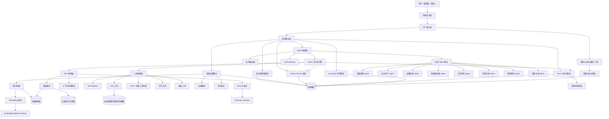

### 4.2 架构说明

系统整体由前端交互层、API 接入层、应用服务层、Agent 编排层、RAG 检索层、工具调用层、数据存储层、权限安全层、Trace 审计层和 Evaluation 评估层组成。

用户通过前端或 API 提交任务，API 层负责认证、参数校验和上下文构造。应用服务层根据业务入口调用 Agent 编排层或其他业务服务。Agent 编排层负责理解用户问题、识别业务场景、选择工具、执行 RAG 检索或 SQL 分析，并根据风险等级决定是否进入人工复核。

所有检索、工具调用、SQL 执行和模型调用都会进入 Trace 与审计系统，形成可查询、可复盘、可评估的完整执行记录。

---

## 5. 系统分层设计

## 5.1 前端交互层

### 5.1.1 职责

前端交互层负责为不同用户提供可视化入口，包括：

- 智能问答；
- 知识库管理；
- 文档上传；
- 合同审查；
- 经营分析；
- Human Review 审核；
- Trace 查看；
- Evaluation 查看；
- 系统配置。

### 5.1.2 页面模块

前端至少包含：

1. 登录与用户上下文页面；
2. 智能问答页面；
3. 知识库管理页面；
4. 文档管理页面；
5. 合同审查页面；
6. 经营分析页面；
7. Human Review 页面；
8. Trace 查询页面；
9. Evaluation 页面；
10. 系统配置页面。

### 5.1.3 设计原则

前端不做核心权限判断，只负责展示和交互。所有关键权限必须由后端服务强制执行。

---

## 5.2 API 接入层

### 5.2.1 职责

API 接入层负责：

- HTTP 请求接入；
- 参数校验；
- 身份认证；
- 权限上下文注入；
- 请求 ID / Trace ID 生成；
- 调用应用服务；
- 返回统一响应；
- 错误处理。

### 5.2.2 API 分类

核心 API 包括：

- 健康检查 API；
- 用户与角色 API；
- 知识库 API；
- 文档 API；
- Chat / Agent API；
- 合同审查 API；
- 经营分析 API；
- 报告生成 API；
- Human Review API；
- Trace API；
- Evaluation API；
- 系统配置 API。

---

## 5.3 应用服务层

### 5.3.1 职责

应用服务层承接 API 请求，组织具体业务逻辑，但不直接实现底层检索、模型调用或工具调用。

主要服务包括：

- UserService；
- PermissionService；
- KnowledgeBaseService；
- DocumentService；
- IngestionService；
- ChatService；
- ContractReviewService；
- AnalyticsService；
- ReportService；
- HumanReviewService；
- TraceService；
- EvaluationService。

### 5.3.2 设计原则

应用服务层负责业务编排，不直接写数据库 SQL，不直接调用模型，不直接操作向量库。底层能力通过 Repository、Gateway、Tool、Retriever 等抽象访问。

---

## 5.4 Agent 编排层

### 5.4.1 职责

Agent 编排层是系统的智能任务调度核心，负责：

- 理解用户输入；
- 识别业务场景；
- 选择业务 Agent；
- 管理 Agent 状态；
- 控制多步骤工作流；
- 选择工具；
- 处理中间结果；
- 判断风险；
- 触发 Human Review；
- 汇总最终答案；
- 记录执行 Trace。

### 5.4.2 核心模块

Agent 编排层包含：

- AgentState；
- AgentRouter；
- WorkflowEngine；
- RiskController；
- ToolSelector；
- EvidenceAggregator；
- FinalAnswerGenerator；
- HumanReviewInterruptor；
- AgentMemory；
- AgentTraceEmitter。

### 5.4.3 Agent 工作流总览

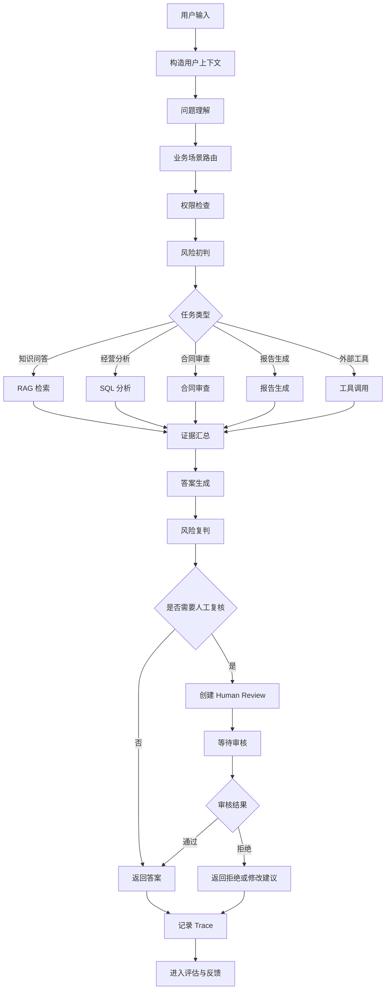

---

## 5.5 业务 Agent 层

业务 Agent 层包含多个面向业务场景的专用 Agent。

### 5.5.1 制度政策 Agent

负责集团制度、流程规范、管理办法类问答。

核心能力：

- 制度类问题识别；
- 制度知识库选择；
- 版本和生效日期识别；
- 多制度交叉引用；
- 答案引用来源。

### 5.5.2 安全生产 Agent

负责安全生产规程、危险作业、隐患治理、应急预案等问答。

核心能力：

- 作业类型识别；
- 风险等级判断；
- 安全规程检索；
- 事故案例检索；
- 高风险回答人工复核；
- 禁止无依据安全建议。

### 5.5.3 设备检修 Agent

负责设备故障排查、检修建议、点检标准、备件建议等。

核心能力：

- 设备类型识别；
- 故障现象识别；
- 历史故障案例检索；
- 排查步骤生成；
- 安全注意事项生成；
- 工单草稿生成。

### 5.5.4 新能源运维 Agent

负责光伏、风电、储能等新能源场景运维辅助。

核心能力：

- 电站类型识别；
- 告警码解释；
- 发电异常分析；
- 设备告警分析；
- 运维建议生成；
- 指标查询工具调用。

### 5.5.5 合同审查 Agent

负责合同解析、条款抽取、风险识别和审查报告生成。

核心能力：

- 合同类型识别；
- 条款抽取；
- 标准模板对比；
- 风险点识别；
- 风险等级分类；
- 法务人工复核。

### 5.5.6 经营分析 Agent

负责自然语言数据查询、SQL 生成、结果分析和报告生成。

核心能力：

- 业务指标理解；
- Schema 理解；
- SQL 生成；
- SQL 安全检查；
- 查询结果解释；
- 图表和报告生成。

### 5.5.7 项目资料 Agent

负责项目可研、审批文件、环评、安评、会议纪要、施工进度等资料问答。

核心能力：

- 项目名称识别；
- 项目阶段识别；
- 审批材料检索；
- 缺失材料识别；
- 风险点总结。

### 5.5.8 报告生成 Agent

负责基于多来源资料生成结构化报告。

核心能力：

- 报告大纲生成；
- 多来源证据聚合；
- 数据分析结果整合；
- 引用来源保留；
- 报告导出。

---

## 5.6 RAG 检索层

### 5.6.1 职责

RAG 检索层负责文档知识的召回、重排序、上下文构造和引用溯源。

核心职责：

- 查询改写；
- 多路检索；
- 权限过滤；
- Dense 检索；
- Sparse / BM25 检索；
- Hybrid Search；
- Rerank；
- Context Compression；
- 引用构造；
- 检索日志记录。

### 5.6.2 RAG 检索流程

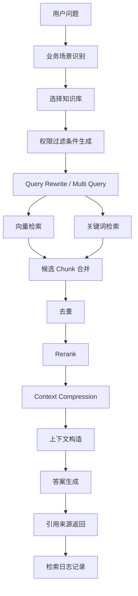

### 5.6.3 检索输入

检索服务输入包括：

- query；
- user_id；
- user_role；
- department；
- business_domain；
- knowledge_base_ids；
- access_scope；
- top_k；
- retrieval_strategy；
- rerank_enabled。

### 5.6.4 检索输出

检索服务输出包括：

- chunk_id；
- document_id；
- knowledge_base_id；
- content；
- score；
- rank；
- page；
- section；
- filename；
- metadata；
- citation 信息。

---

## 5.7 文档处理层

### 5.7.1 职责

文档处理层负责从原始文件到可检索知识单元的完整处理。

包括：

- 文件上传；
- 元数据登记；
- 文档解析；
- 文本清洗；
- 文档切分；
- Chunk 生成；
- Embedding 生成；
- 向量索引；
- 全文索引；
- 索引状态更新。

### 5.7.2 文档处理流程

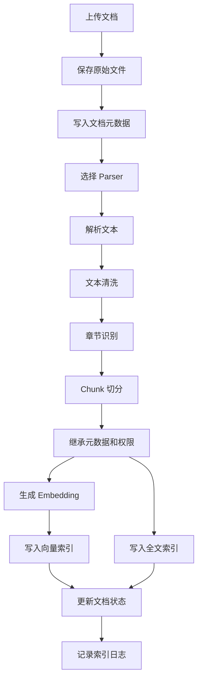

### 5.7.3 Parser 设计

文档解析器统一抽象为 Parser。

Parser 输入：

- file_path；
- file_type；
- metadata。

Parser 输出：

- title；
- text；
- pages；
- sections；
- tables；
- metadata；
- parse_status。

### 5.7.4 Chunker 设计

Chunker 需要支持：

- 按固定长度切分；
- 按章节标题切分；
- 语义切分；
- parent-child chunk；
- overlap；
- 页码保留；
- 表格处理；
- 元数据继承；
- 权限继承。

---

## 5.8 工具调用层

### 5.8.1 职责

工具调用层负责统一管理和执行 Agent 可调用的工具。

工具包括：

- RAG 检索工具；
- 文档读取工具；
- SQL 查询工具；
- 合同审查工具；
- 报告生成工具；
- 邮件草稿工具；
- 工单草稿工具；
- 外部 API 工具；
- MCP 工具代理。

### 5.8.2 Tool Registry

所有工具必须注册到 Tool Registry。

工具元数据包括：

- tool_name；
- description；
- input_schema；
- output_schema；
- required_permission；
- risk_level；
- timeout；
- retry_policy；
- audit_enabled；
- human_review_required。

### 5.8.3 工具调用流程

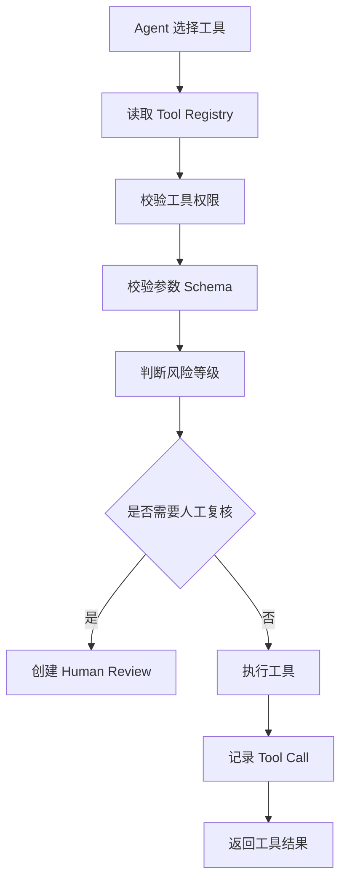

---

## 5.9 SQL 分析层

### 5.9.1 职责

SQL 分析层负责自然语言到安全 SQL 查询和结果解释。

核心能力包括：

- 业务问题理解；
- Schema 检索；
- 指标口径匹配；
- SQL 生成；
- SQL 安全校验；
- 只读查询；
- 查询结果解释；
- 图表数据生成；
- SQL 审计。

### 5.9.2 SQL Agent 流程

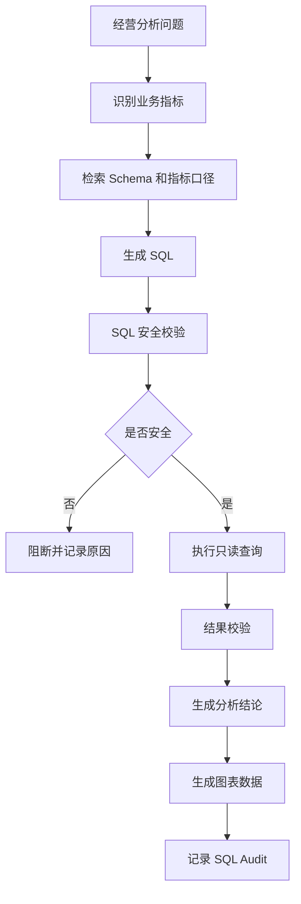

### 5.9.3 SQL 安全规则

必须禁止：

- INSERT；
- UPDATE；
- DELETE；
- DROP；
- ALTER；
- TRUNCATE；
- CREATE；
- 非白名单函数；
- 无 LIMIT 的大查询；
- 越权字段查询。

必须支持：

- 只读账号；
- SQL parser 校验；
- 字段级权限；
- 自动 LIMIT；
- 查询超时；
- 返回行数限制；
- 审计记录。

---

## 5.10 合同审查层

### 5.10.1 职责

合同审查层负责合同解析、条款抽取、制度对比、风险识别和审查报告生成。

### 5.10.2 合同审查流程

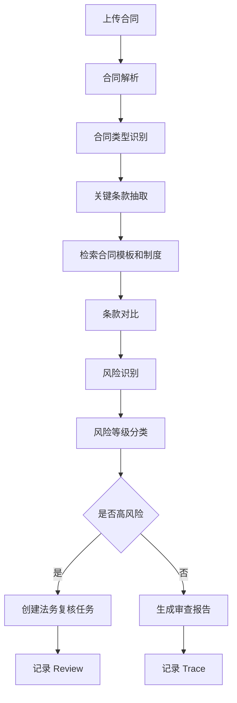

### 5.10.3 风险类型

合同风险包括：

- 付款条件不明确；
- 验收标准不明确；
- 交付期限不明确；
- 违约责任不足；
- 质量保证条款缺失；
- 安全责任缺失；
- 环保责任缺失；
- 争议解决条款不完整；
- 与集团制度不一致；
- 高金额合同缺少审批要素。

---

## 5.11 Human Review 层

### 5.11.1 职责

Human Review 层用于处理高风险任务的人工复核。

触发场景包括：

- 安全生产高风险回答；
- 合同重大风险判断；
- SQL 敏感数据查询；
- 外部系统高风险工具调用；
- 正式报告输出；
- 邮件或工单正式提交。

### 5.11.2 Human Review 流程

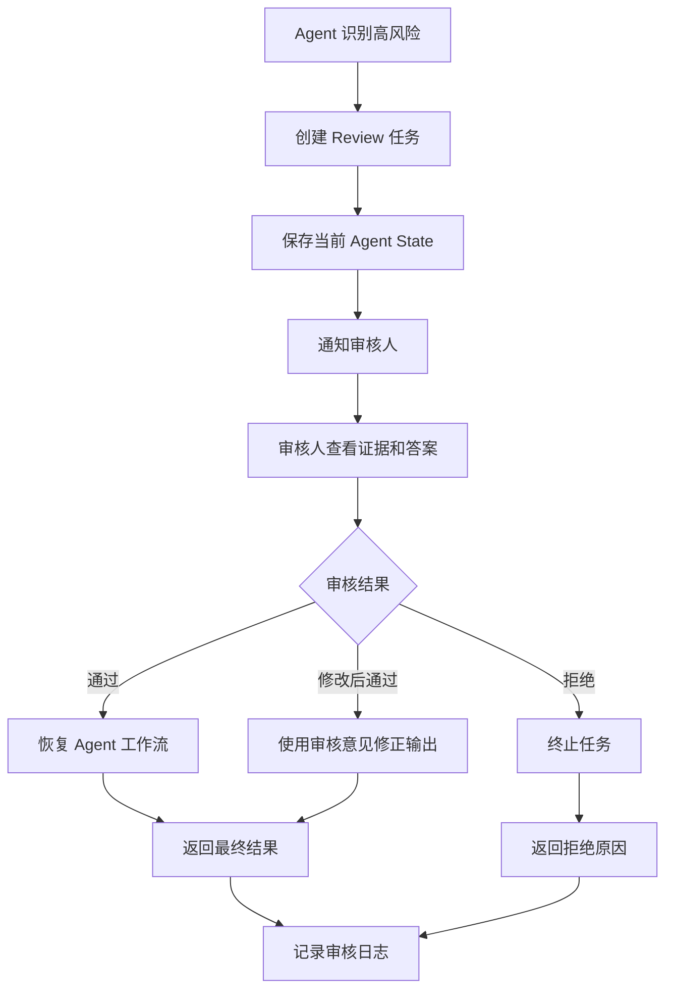

### 5.11.3 Review 状态

Review 状态包括：

- pending；
- approved；
- rejected；
- revised；
- expired；
- cancelled。

---

## 5.12 MCP / 外部工具接入层

### 5.12.1 职责

外部工具接入层负责让 Agent 以统一方式调用外部系统。

可接入：

- 文件系统；
- 业务数据库；
- 邮件系统；
- 工单系统；
- 调度系统；
- 项目管理系统；
- GitHub；
- 内部 API；
- 搜索服务。

### 5.12.2 接入原则

外部工具不得直接暴露给 Agent 任意调用，必须经过：

- 工具注册；
- 参数 Schema；
- 权限校验；
- 风险等级判断；
- 超时控制；
- 审计记录；
- 必要时人工复核。

### 5.12.3 MCP 工具代理流程

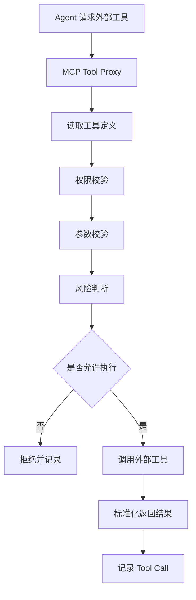

---

## 5.13 权限与安全层

### 5.13.1 职责

权限与安全层负责统一处理用户、角色、部门、资源和工具权限。

### 5.13.2 权限对象

系统需要控制：

- API 权限；
- 页面权限；
- 知识库权限；
- 文档权限；
- Chunk 检索权限；
- 工具调用权限；
- SQL 表权限；
- SQL 字段权限；
- Trace 查看权限；
- Human Review 权限；
- 系统配置权限。

### 5.13.3 权限过滤流程

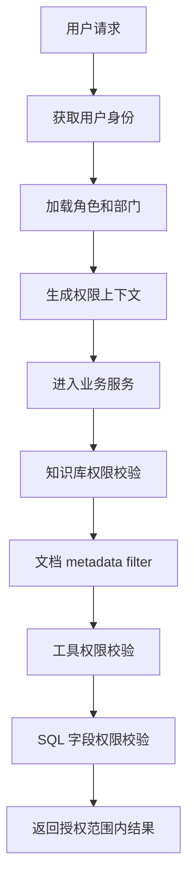

### 5.13.4 权限上下文

PermissionContext 应包含：

- user_id；
- role；
- department；
- allowed_knowledge_bases；
- allowed_business_domains；
- allowed_tools；
- allowed_sql_tables；
- allowed_sql_fields；
- trace_access_scope；
- review_permissions。

---

## 5.14 Trace 与审计层

### 5.14.1 职责

Trace 与审计层负责记录系统关键行为。

需要记录：

- 用户请求；
- Agent 路由；
- RAG 检索；
- Tool Call；
- LLM Call；
- SQL 生成和执行；
- Human Review；
- 错误信息；
- 延迟；
- Token；
- 成本；
- 最终答案。

### 5.14.2 Trace 主链路

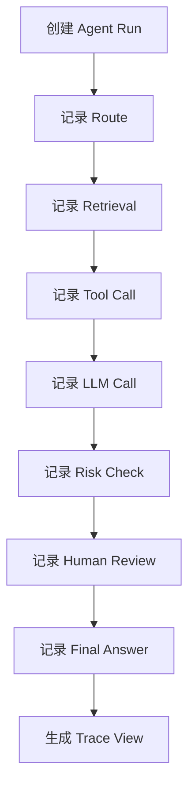

### 5.14.3 Trace 查询维度

支持按以下维度查询：

- run_id；
- user_id；
- business_domain；
- route；
- status；
- risk_level；
- tool_name；
- document_id；
- 时间范围；
- 错误类型。

---

## 5.15 Evaluation 评估层

### 5.15.1 职责

Evaluation 评估层负责对 RAG、Agent、SQL、合同审查和工具调用效果进行评估。

### 5.15.2 评估对象

包括：

- 检索结果；
- 答案质量；
- 引用准确性；
- Agent 路由；
- 工具调用；
- SQL 生成；
- 合同风险识别；
- Human Review 触发；
- 多轮任务完成率。

### 5.15.3 评估流程

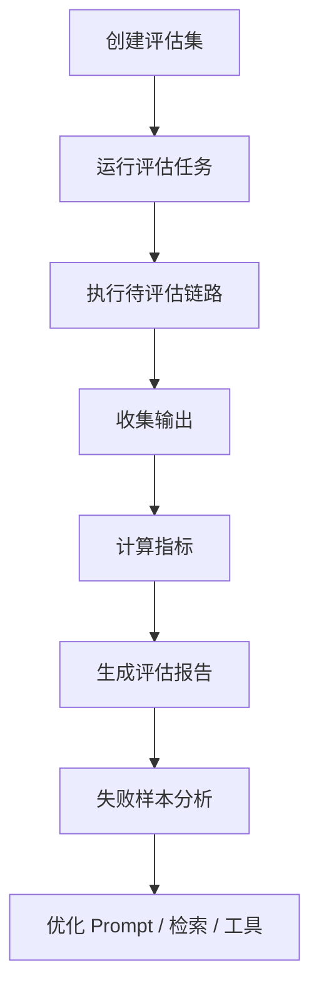

### 5.15.4 核心指标

RAG 指标：

- Retrieval Recall；
- Context Precision；
- Context Recall；
- Answer Faithfulness；
- Answer Relevancy；
- Citation Accuracy；
- Hallucination Rate。

Agent 指标：

- Route Accuracy；
- Tool Call Accuracy；
- Task Success Rate；
- Human Review Trigger Accuracy；
- Error Recovery Rate。

SQL 指标：

- SQL Validity；
- SQL Safety；
- Execution Accuracy；
- Result Explanation Accuracy。

合同审查指标：

- Risk Identification Recall；
- Risk Classification Accuracy；
- Clause Extraction Accuracy；
- Human Reviewer Agreement Rate。

---

## 5.16 数据存储层

### 5.16.1 存储分类

系统需要以下类型存储：

1. 业务元数据存储；
2. 原始文件存储；
3. 文档 Chunk 存储；
4. 向量索引存储；
5. 全文检索索引；
6. 经营分析数据库；
7. Trace 审计数据库；
8. Evaluation 数据集存储；
9. 缓存与任务状态存储。

### 5.16.2 数据边界

- 原始文件用于重新解析和审计；
- 文档元数据用于权限和检索过滤；
- Chunk 内容用于检索和引用；
- 向量索引用于语义检索；
- 全文索引用于关键词检索；
- Trace 数据用于审计和评估；
- Evaluation 数据用于效果优化。

---

## 5.17 部署运维层

### 5.17.1 职责

部署运维层负责：

- 本地开发环境；
- 测试环境；
- 生产环境；
- 服务启动；
- 配置管理；
- 日志收集；
- 健康检查；
- 监控告警；
- 数据备份；
- 模型服务配置。

### 5.17.2 部署架构

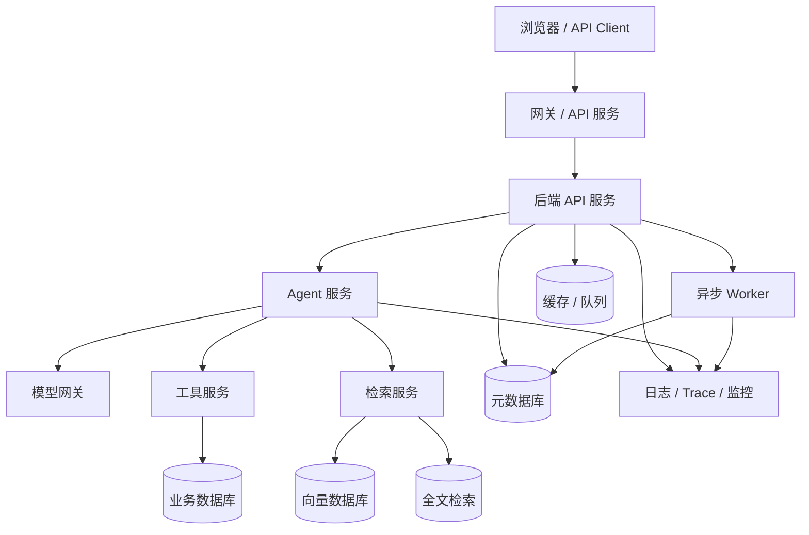

---

## 6. 核心业务流程设计

## 6.1 智能问答流程

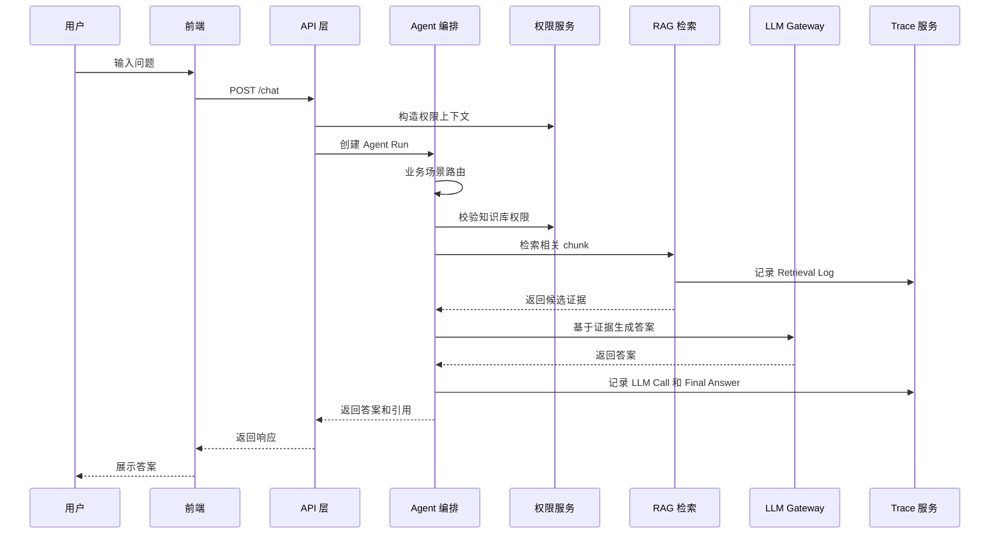

---

## 6.2 文档入库流程

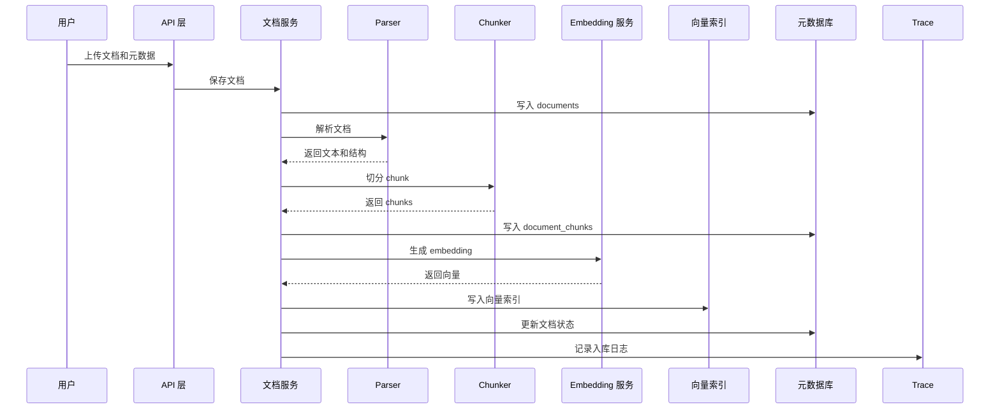

---

## 6.3 经营分析流程

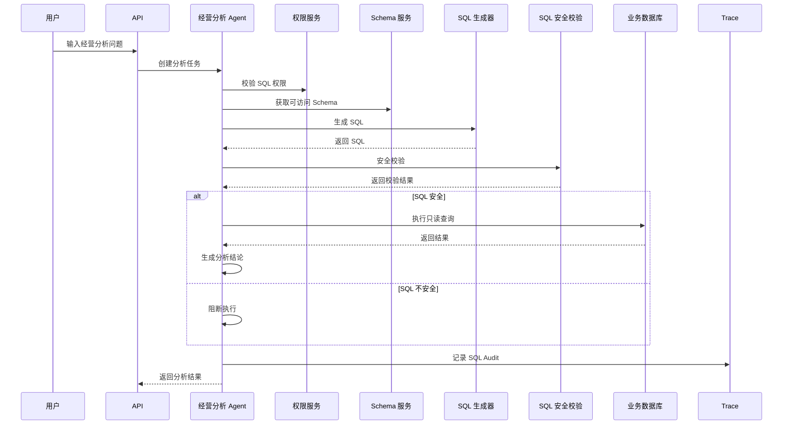

---

## 6.4 合同审查流程

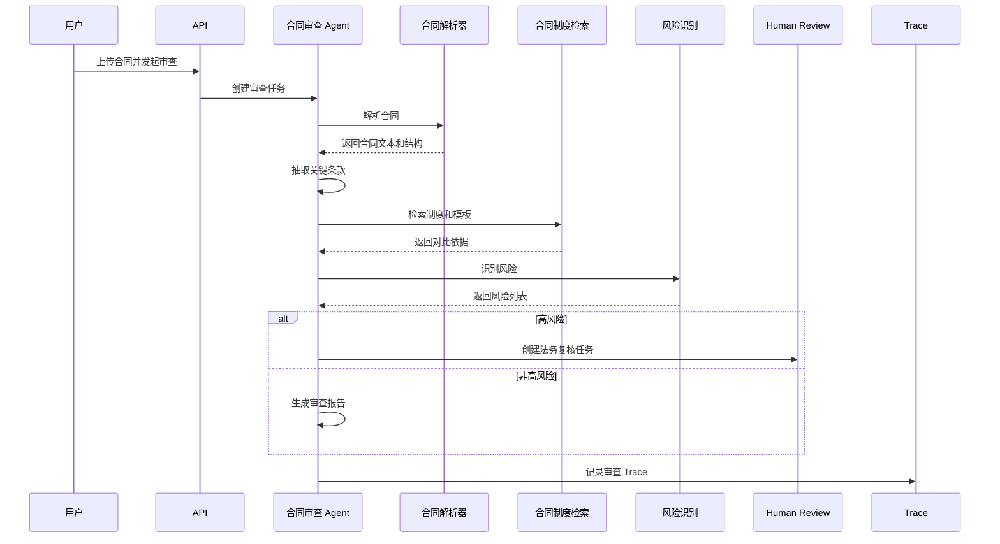

---

## 7. 核心数据模型设计

## 7.1 用户与权限相关

### users

- id
- username
- email
- department_id
- role_id
- status
- created_at
- updated_at

### departments

- id
- name
- parent_id
- created_at
- updated_at

### roles

- id
- name
- description
- created_at
- updated_at

### permissions

- id
- permission_code
- permission_name
- resource_type
- action
- created_at

### role_permissions

- id
- role_id
- permission_id
- created_at

---

## 7.2 知识库与文档相关

### knowledge_bases

- id
- name
- business_domain
- description
- access_roles
- status
- created_at
- updated_at

### documents

- id
- title
- filename
- file_type
- file_size
- storage_path
- business_domain
- knowledge_base_id
- department_id
- version
- effective_date
- security_level
- access_scope
- status
- uploaded_by
- created_at
- updated_at

### document_chunks

- id
- document_id
- knowledge_base_id
- business_domain
- chunk_index
- content
- page
- section
- metadata
- created_at

### document_ingestion_jobs

- id
- document_id
- job_type
- status
- error_message
- started_at
- ended_at
- created_at

---

## 7.3 Agent 与 Trace 相关

### agent_runs

- id
- user_id
- user_role
- query
- route
- business_domain
- selected_knowledge_bases
- risk_level
- need_human_review
- review_status
- status
- final_answer
- latency_ms
- error_message
- created_at
- updated_at

### tool_calls

- id
- run_id
- tool_name
- input_json
- output_json
- risk_level
- status
- latency_ms
- error_message
- created_at

### retrieval_logs

- id
- run_id
- query
- knowledge_base_id
- document_id
- chunk_id
- score
- rank
- content_preview
- created_at

### llm_calls

- id
- run_id
- model_name
- prompt_template
- input_tokens
- output_tokens
- latency_ms
- status
- error_message
- created_at

### sql_audits

- id
- run_id
- user_id
- generated_sql
- checked_sql
- is_safe
- blocked_reason
- execution_status
- row_count
- latency_ms
- created_at

### human_reviews

- id
- run_id
- risk_level
- review_status
- reviewer_id
- review_comment
- created_at
- reviewed_at

---

## 7.4 Evaluation 相关

### evaluation_datasets

- id
- name
- evaluation_type
- description
- created_by
- created_at

### evaluation_samples

- id
- dataset_id
- query
- expected_answer
- expected_citations
- metadata
- created_at

### evaluation_tasks

- id
- dataset_id
- evaluation_type
- status
- metrics
- result_json
- created_at
- completed_at

### evaluation_results

- id
- task_id
- sample_id
- actual_answer
- actual_citations
- score_json
- error_message
- created_at

---

## 8. 代码目录结构设计

建议项目目录结构如下：

```text
enterprise-knowledge-agentic-rag/
├── apps/
│   ├── api/
│   │   ├── main.py
│   │   ├── deps.py
│   │   ├── middlewares/
│   │   ├── routes/
│   │   │   ├── health.py
│   │   │   ├── users.py
│   │   │   ├── knowledge_bases.py
│   │   │   ├── documents.py
│   │   │   ├── chat.py
│   │   │   ├── contracts.py
│   │   │   ├── analytics.py
│   │   │   ├── reports.py
│   │   │   ├── reviews.py
│   │   │   ├── traces.py
│   │   │   └── evaluations.py
│   │   └── schemas/
│   │       ├── common.py
│   │       ├── users.py
│   │       ├── documents.py
│   │       ├── chat.py
│   │       ├── contracts.py
│   │       ├── analytics.py
│   │       ├── reviews.py
│   │       └── traces.py
│   │
│   ├── worker/
│   │   ├── main.py
│   │   └── tasks/
│   │       ├── document_ingestion.py
│   │       ├── evaluation.py
│   │       └── report_generation.py
│   │
│   └── web/
│       └── README.md
│
├── core/
│   ├── config/
│   │   ├── settings.py
│   │   └── logging.py
│   │
│   ├── domain/
│   │   ├── users/
│   │   ├── knowledge_bases/
│   │   ├── documents/
│   │   ├── agents/
│   │   ├── reviews/
│   │   └── evaluations/
│   │
│   ├── database/
│   │   ├── session.py
│   │   ├── base.py
│   │   ├── models/
│   │   └── repositories/
│   │
│   ├── security/
│   │   ├── auth.py
│   │   ├── permissions.py
│   │   ├── policy.py
│   │   └── masking.py
│   │
│   ├── agent/
│   │   ├── state.py
│   │   ├── router.py
│   │   ├── workflow.py
│   │   ├── risk.py
│   │   ├── memory.py
│   │   ├── prompts/
│   │   ├── nodes/
│   │   │   ├── route_node.py
│   │   │   ├── retrieval_node.py
│   │   │   ├── sql_node.py
│   │   │   ├── contract_node.py
│   │   │   ├── review_node.py
│   │   │   └── final_answer_node.py
│   │   └── business_agents/
│   │       ├── policy_agent.py
│   │       ├── safety_agent.py
│   │       ├── equipment_agent.py
│   │       ├── new_energy_agent.py
│   │       ├── contract_agent.py
│   │       ├── analytics_agent.py
│   │       ├── project_agent.py
│   │       └── report_agent.py
│   │
│   ├── rag/
│   │   ├── ingestion/
│   │   │   ├── parsers/
│   │   │   ├── chunkers/
│   │   │   └── pipeline.py
│   │   ├── retrieval/
│   │   │   ├── retriever.py
│   │   │   ├── query_rewrite.py
│   │   │   ├── hybrid_search.py
│   │   │   ├── rerank.py
│   │   │   └── context_builder.py
│   │   ├── citations/
│   │   └── evaluation/
│   │
│   ├── llm/
│   │   ├── gateway.py
│   │   ├── providers/
│   │   └── prompts/
│   │
│   ├── embeddings/
│   │   ├── gateway.py
│   │   └── providers/
│   │
│   ├── vectorstore/
│   │   ├── base.py
│   │   └── providers/
│   │
│   ├── search/
│   │   ├── base.py
│   │   └── providers/
│   │
│   ├── tools/
│   │   ├── registry.py
│   │   ├── base.py
│   │   ├── rag_tools.py
│   │   ├── sql_tools.py
│   │   ├── contract_tools.py
│   │   ├── report_tools.py
│   │   ├── file_tools.py
│   │   └── mcp_proxy.py
│   │
│   ├── analytics/
│   │   ├── schema_service.py
│   │   ├── sql_generator.py
│   │   ├── sql_guard.py
│   │   └── result_analyzer.py
│   │
│   ├── contracts/
│   │   ├── parser.py
│   │   ├── clause_extractor.py
│   │   ├── risk_checker.py
│   │   └── report_builder.py
│   │
│   ├── review/
│   │   ├── service.py
│   │   └── policy.py
│   │
│   ├── observability/
│   │   ├── trace.py
│   │   ├── audit.py
│   │   ├── metrics.py
│   │   └── logger.py
│   │
│   └── evaluation/
│       ├── datasets.py
│       ├── metrics.py
│       ├── runner.py
│       └── reports.py
│
├── docs/
│   ├── PRD.md
│   ├── ARCHITECTURE.md
│   ├── TECH_SELECTION.md
│   ├── AGENT_WORKFLOW.md
│   ├── RAG_DESIGN.md
│   ├── SECURITY_DESIGN.md
│   └── EVALUATION_DESIGN.md
│
├── tests/
│   ├── unit/
│   ├── integration/
│   └── e2e/
│
├── scripts/
│   ├── init_db.py
│   ├── seed_demo_data.py
│   └── run_eval.py
│
├── docker/
│   ├── Dockerfile.api
│   ├── Dockerfile.worker
│   └── nginx/
│
├── docker-compose.yml
├── pyproject.toml
├── README.md
├── AGENTS.md
└── .env.example
```

---

## 9. 核心接口规划

### 9.1 系统健康

```http
GET /health
```

### 9.2 用户与权限

```http
GET /api/v1/users/me
GET /api/v1/roles
GET /api/v1/permissions
```

### 9.3 知识库

```http
POST /api/v1/knowledge-bases
GET /api/v1/knowledge-bases
GET /api/v1/knowledge-bases/{kb_id}
PUT /api/v1/knowledge-bases/{kb_id}
DELETE /api/v1/knowledge-bases/{kb_id}
```

### 9.4 文档

```http
POST /api/v1/documents/upload
GET /api/v1/documents
GET /api/v1/documents/{document_id}
POST /api/v1/documents/{document_id}/reindex
DELETE /api/v1/documents/{document_id}
```

### 9.5 智能问答

```http
POST /api/v1/chat
```

### 9.6 合同审查

```http
POST /api/v1/contracts/review
GET /api/v1/contracts/reviews/{review_id}
```

### 9.7 经营分析

```http
POST /api/v1/analytics/query
POST /api/v1/analytics/explain-sql
```

### 9.8 报告生成

```http
POST /api/v1/reports/generate
GET /api/v1/reports/{report_id}
```

### 9.9 Human Review

```http
GET /api/v1/reviews
GET /api/v1/reviews/{review_id}
POST /api/v1/reviews/{review_id}/decision
```

### 9.10 Trace

```http
GET /api/v1/traces
GET /api/v1/traces/{run_id}
```

### 9.11 Evaluation

```http
POST /api/v1/evaluations
GET /api/v1/evaluations
GET /api/v1/evaluations/{task_id}
```

---

## 10. 配置设计

系统配置分为：

1. 应用配置；
2. 数据库配置；
3. 模型配置；
4. 向量库配置；
5. 搜索引擎配置；
6. 文件存储配置；
7. 安全配置；
8. Trace 配置；
9. Evaluation 配置；
10. 工具调用配置。

配置必须通过环境变量、配置文件或密钥管理系统读取，禁止在代码中硬编码密钥。

---

## 11. 错误处理设计

系统错误需要统一封装。

错误类型包括：

- 参数错误；
- 未认证；
- 无权限；
- 资源不存在；
- 文档解析失败；
- 索引失败；
- 检索失败；
- LLM 调用失败；
- 工具调用失败；
- SQL 安全校验失败；
- Human Review 等待中；
- 系统内部错误。

错误响应需要包含：

- error_code；
- message；
- trace_id；
- detail，可选。

---

## 12. 日志设计

日志类型包括：

- access log；
- application log；
- agent log；
- retrieval log；
- tool call log；
- sql audit log；
- security log；
- evaluation log；
- error log。

日志必须支持通过 trace_id 串联。

---

## 13. 测试策略

### 13.1 单元测试

覆盖：

- 权限判断；
- Parser；
- Chunker；
- Retriever；
- SQL Guard；
- Tool Registry；
- Risk Policy；
- Agent Router。

### 13.2 集成测试

覆盖：

- 文档入库链路；
- RAG 问答链路；
- SQL 分析链路；
- 合同审查链路；
- Human Review 链路；
- Trace 查询链路。

### 13.3 端到端测试

覆盖：

- 上传安全规程并提问；
- 上传设备手册并故障问答；
- 上传合同并生成风险报告；
- 输入经营分析问题并生成 SQL；
- 高风险问题触发人工审核。

### 13.4 评估测试

覆盖：

- 检索召回；
- 答案忠实度；
- 引用准确率；
- 路由准确率；
- SQL 安全；
- 工具调用准确率。

---

## 14. 后续技术选型待讨论项

本文档暂不确定具体技术栈。以下内容需要在 `docs/TECH_SELECTION.md` 中单独讨论：

1. 后端框架；
2. Agent 编排框架；
3. LLM 接入方式；
4. Embedding 模型；
5. Reranker 模型；
6. 向量数据库；
7. 全文检索引擎；
8. 数据库；
9. 缓存和队列；
10. 前端框架；
11. 文件存储；
12. OCR 方案；
13. MCP 接入方式；
14. 可观测性方案；
15. 部署方式；
16. 测试框架；
17. 包管理工具。

---

## 15. 架构验收标准

本架构设计完成后，后续代码实现必须满足：

1. 项目目录结构与本文档保持一致或有明确变更说明。
2. API 层不直接实现复杂业务逻辑。
3. Agent 层不直接操作数据库和向量库。
4. RAG 层必须支持权限过滤。
5. 工具调用必须通过 Tool Registry。
6. SQL 执行必须经过 SQL Guard。
7. 高风险任务必须可进入 Human Review。
8. 所有关键链路必须记录 Trace。
9. Evaluation 能够独立运行。
10. 技术选型可以替换，但模块边界不能混乱。
11. 所有密钥和环境相关配置不得硬编码。
12. 核心模块必须具备基础测试。

---

## 16. 当前版本说明

当前文档为系统架构设计 v1，核心目标是确定生产级完整系统的：

- 分层架构；
- 模块边界；
- 业务 Agent 划分；
- RAG 检索链路；
- 文档入库链路；
- SQL 分析链路；
- 合同审查链路；
- Human Review 链路；
- 权限安全链路；
- Trace 审计链路；
- Evaluation 评估链路；
- 代码目录结构。

后续需要继续产出：

1. `docs/TECH_SELECTION.md`
2. `docs/AGENT_WORKFLOW.md`
3. `docs/RAG_DESIGN.md`
4. `docs/SECURITY_DESIGN.md`
5. `docs/EVALUATION_DESIGN.md`
6. `AGENTS.md`
