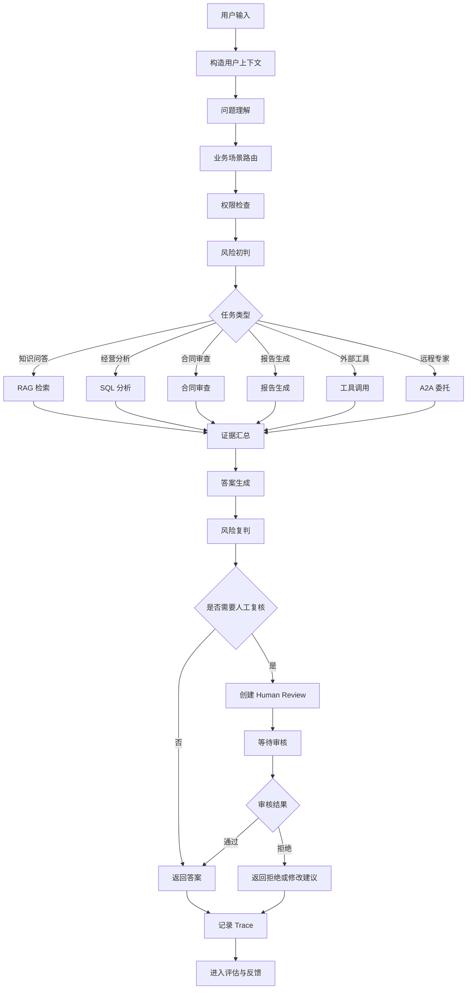
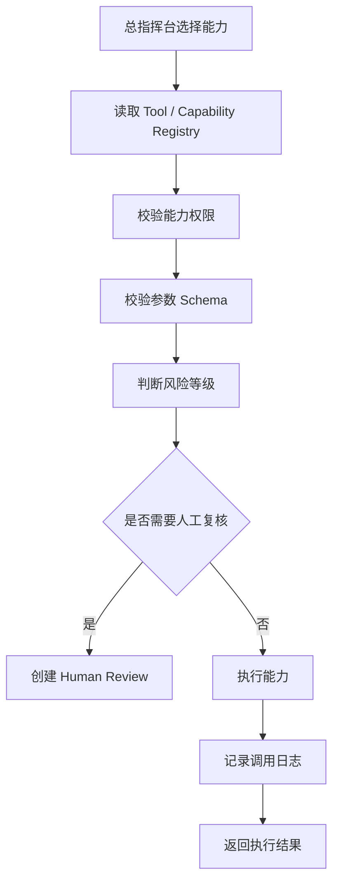
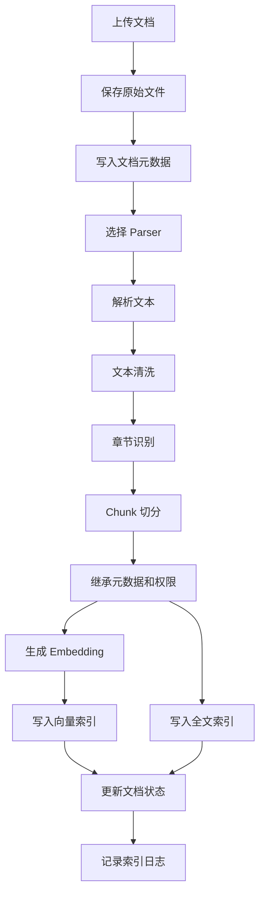
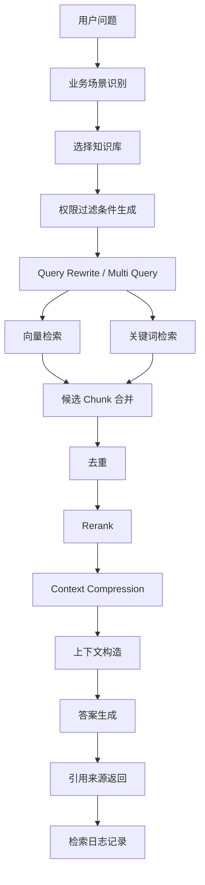
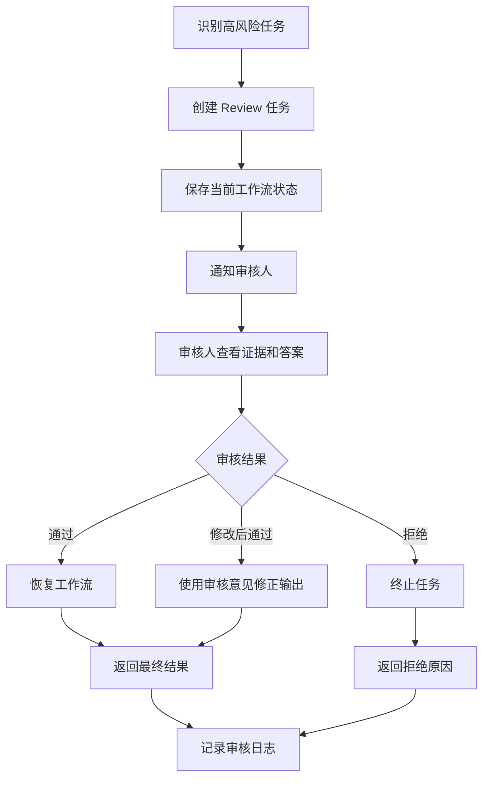
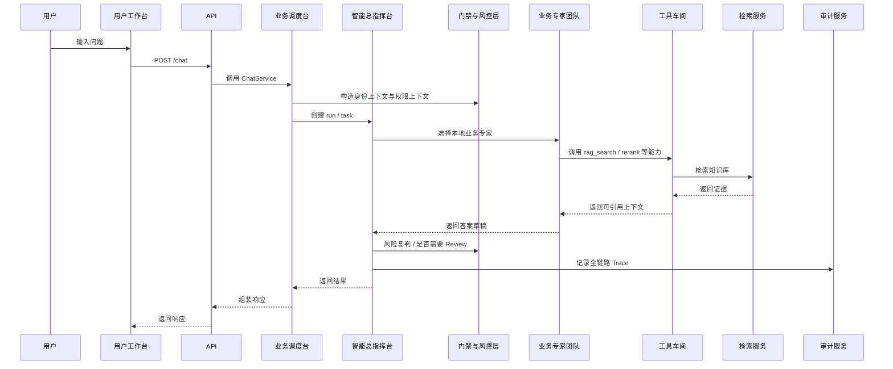
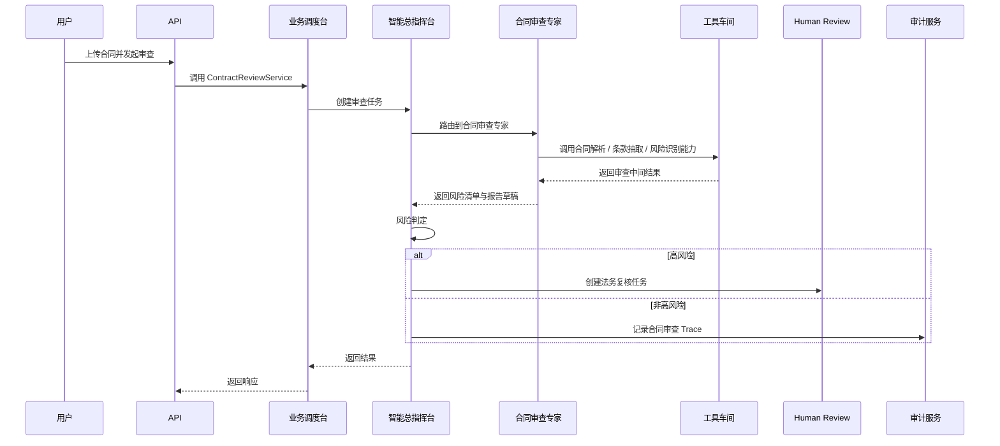
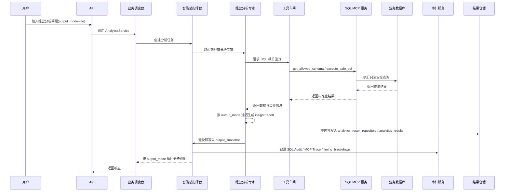
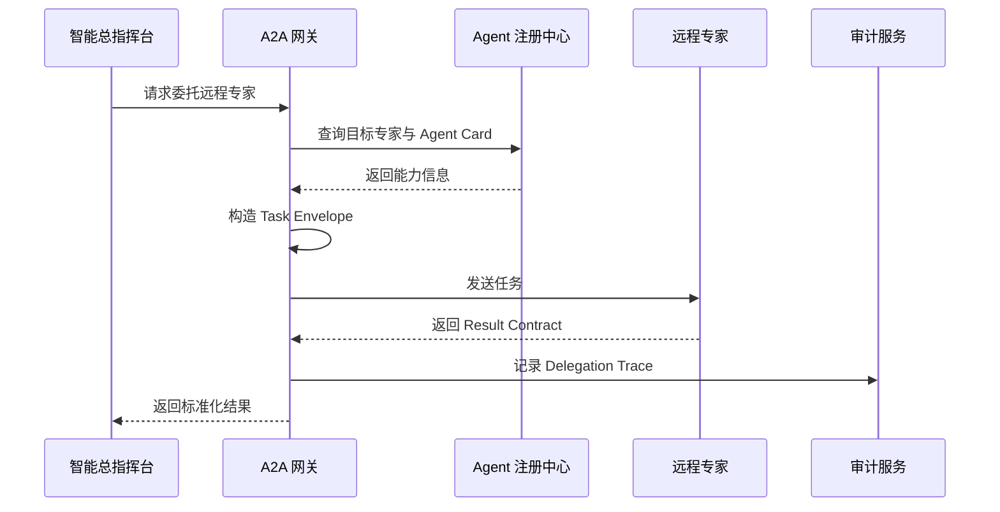

# 新疆能源集团知识与生产经营智能 Agent 平台 系统架构设计文档

## 1. 文档说明

本文档为 **新疆能源集团知识与生产经营智能 Agent 平台** 的当前唯一总架构文档。

本文档吸收并统一了两类设计思路：

1. 生产级 Agentic RAG 平台设计；
2. A2A-ready / MCP-ready / Multi-Agent-ready 的企业级 Agent 协作设计。

为了让团队成员、业务方和面试官都更容易理解，本文档采用：

**正式技术名 + 形象中文名** 的写法。

例如：

- 用户工作台（Interaction Layer）
- 门禁与风控层（Access & Policy Layer）
- 业务调度台（Application Service Layer）
- 智能总指挥台（Agent Control Plane）
- 业务专家团队（Agent Mesh Layer）
- 工具车间（Capability Fabric Layer）
- 知识与数据底座（Knowledge & Data Plane）
- 监督与保障层（Governance Plane）
- 运行支撑层（Runtime & Infra Layer）

后续架构讨论、模块扩展、Agent 接入、协议接入、治理体系和实现边界，均以本文档为准。

### 1.1 本文档重点回答的问题

本文档重点回答以下问题：

- 系统为什么不是简单聊天机器人，而是企业级 Agent 平台；
- 为什么要采用多入口业务工作台，而不是只有一个对话框；
- 为什么要引入智能总指挥台、业务专家团队、工具车间；
- MCP 和 A2A 在系统中的边界是什么；
- 本地 Tool、MCP Tool、Remote Agent 分别适合什么场景；
- 为什么第一期就要做协议、治理、审计和评估预留；
- 当前第一期应该真正实现哪些部分，哪些部分先预留接口和协议。

### 1.2 设计结论

本项目第一期架构的核心结论是：

> 采用 **单控制面 + 多业务 Agent + 统一能力织物 + 协议化接入 + 治理优先** 的企业级 Agent 平台架构。

更形象地说，可以把整个系统理解成：

- 最上面是 **用户工作台**；
- 入口先经过 **门禁与风控层**；
- 业务请求进入 **业务调度台**；
- 核心由 **智能总指挥台** 统一调度；
- 下面是一组按业务分工的 **业务专家团队**；
- 专家真正干活时，会去 **工具车间** 调能力；
- 平台运行依赖 **知识与数据底座**；
- 全过程由 **监督与保障层** 负责复核、审计和评估；
- 系统后台由 **运行支撑层** 提供异步任务、部署和监控能力。

---

## 2. 架构目标

系统需要同时满足“当前业务落地”和“未来平台扩展”两类目标。

### 2.1 当前业务目标

第一期支持以下核心业务：

- 集团制度政策问答
- 安全生产规程问答
- 设备检修与故障排查
- 新能源电站运维辅助
- 合同与合规审查
- 经营数据分析
- 项目建设资料问答
- 报告生成
- Human Review 人工复核
- Trace 审计
- Evaluation 评估
- 支持多轮对话、会话记忆、槽位澄清与用户补充信息后的任务恢复执行

### 2.2 平台化目标

第一期必须为未来预留：

- 新增业务 Agent 的标准接入方式
- 远程 Agent 的 A2A 协作能力
- 工具能力的 MCP 协议化接入能力
- 统一权限、风险、审计、评估模型
- 支持多轮对话、上下文继承、澄清追问与恢复执行的工作流能力
- 从集中式落地到服务化拆分的平滑演进能力

### 2.3 企业级治理目标

系统必须支持：

- 权限前置
- 风险前置
- 高风险任务中断与复核
- 统一任务契约
- 统一结果契约
- 全链路 Trace
- SQL 审计
- Policy Logs
- Evaluation 指标闭环
- 可观测性

---

## 3. 核心架构原则

### 3.1 Workflow-first

Agent 不是自由聊天机器人，而是受控工作流执行体。

解释：

企业场景下最重要的不是“模型会不会聊天”，而是：

- 能不能稳定执行；
- 能不能按步骤完成；
- 能不能在高风险节点停下来；
- 能不能恢复执行；
- 能不能被审计与复盘。

所以系统必须以 **状态机 + 工作流** 为核心，而不是只靠自由推理。

### 3.2 Tool-first

Agent 负责理解、决策、编排；执行逻辑优先交给工具或能力服务完成。

解释：

这样做的原因是：

- 工具更容易做权限控制；
- 工具更容易做参数校验；
- 工具更容易做超时、重试和审计；
- 工具更容易解耦与复用；
- 工具更容易在未来服务化或协议化。

### 3.3 Evidence-first

问答、审查、分析和报告输出尽量基于可追溯证据，而不是纯生成。

解释：

本项目属于企业知识、制度、安全、合同、经营数据场景。用户需要的不是“像真的答案”，而是“有依据、能追溯、可引用”的答案。

### 3.4 Governance-first

系统从第一期开始就必须可控、可审计、可评估、可追踪。

解释：

企业级 Agent 平台必须回答这些问题：

- 为什么选了这个路由；
- 为什么调了这个工具；
- 为什么这次 SQL 被拦截；
- 为什么触发了 Human Review；
- 为什么这次 A2A 委托失败；
- 为什么这个答案被判定为高风险。

### 3.5 Protocol-ready

第一期就明确区分：

- Tool Calling
- MCP Tool 接入
- A2A Agent 协作

避免后续接入新能力时推翻原架构。

### 3.6 Local-first, Service-ready

第一期允许部分 Agent 仍以内嵌模块方式存在，但抽象必须支持未来独立部署为远程 Agent 或 MCP 服务。

解释：

这意味着：

- 第一阶段不强行把所有东西拆成很多服务；
- 但第一阶段就把边界、协议、契约、元数据、治理模型设计好；
- 这样后续拆分时不需要重做系统。

### 3.7 权限前置

所有知识检索、工具调用、SQL 查询、远程 Agent 委托、Trace 查看都必须先经过权限判断，不能只靠前端控制，也不能只靠 Prompt 约束。

### 3.8 高风险任务可中断、可复核、可恢复

涉及安全生产、合同重大风险、经营敏感数据、外部系统操作等高风险任务，必须支持：

- 风险识别
- Human Review 创建
- 工作流中断
- 人工审核
- 审核后继续执行或终止
- 审核日志记录

### 3.9 可评估、可优化

RAG、Agent、SQL、合同审查、MCP 调用、A2A 委托、Human Review 触发都必须可评估。

### 3.10 多轮可承接、缺信息可澄清、补信息可恢复

企业级 Agent 平台不能只支持“单轮输入 → 单轮输出”，还必须支持：

- 多轮对话上下文承接；
- 会话级短期记忆；
- 信息缺失时的槽位澄清；
- 用户补充信息后的任务恢复执行；
- 高风险场景下禁止基于模糊上下文盲猜执行。

这项能力属于平台级能力，不只是某一个业务工作流的局部优化。

---

## 4. 总体分层

系统采用九层更易理解的表达方式：

1. 用户工作台（Interaction Layer）
2. 门禁与风控层（Access & Policy Layer）
3. 业务调度台（Application Service Layer）
4. 智能总指挥台（Agent Control Plane）
5. 业务专家团队（Agent Mesh Layer）
6. 工具车间（Capability Fabric Layer）
7. 知识与数据底座（Knowledge & Data Plane）
8. 监督与保障层（Governance Plane）
9. 运行支撑层（Runtime & Infra Layer）

---

## 4.1 经营分析真实数据源一期定位

经营分析模块当前已经进入“可交付分析能力”阶段，因此数据源层不再只是 demo 实现，而需要明确一期定位：

- `local_analytics`
  - 本地 demo / fallback 数据源；
  - 用于本地开发、测试、联调和无真实库环境下的完整链路验证。

- `enterprise_readonly`
  - 真实经营分析只读数据源默认 key；
  - 一期默认优先按 PostgreSQL 接入；
  - 如果企业已有现成只读 PostgreSQL、MySQL 或数仓视图，架构上允许接入，但参考实现仍优先 PostgreSQL。

### 为什么一期真实经营分析数据源优先 PostgreSQL

一期优先 PostgreSQL 的原因不是排斥其他库，而是为了工程稳定性：

- 与平台元数据库一致，降低接入和运维复杂度；
- PostgreSQL 自带成熟的分区、索引、只读账号、视图与 JSONB 能力；
- 对日粒度事实表、维表和规则式经营分析查询足够稳健；
- 与当前 `SQL Gateway / SQL MCP-compatible` 执行层更容易对齐。

### Data Source Registry Center 的职责

当前系统已经引入 `Data Source Registry Center`，它的职责是：

- 管理默认内置数据源；
- 管理 `enterprise_readonly` 等真实数据源定义；
- 支持 repository override；
- 支持数据源启用/停用、描述、权限要求等元数据；
- 作为 `SchemaRegistry / SQL Builder / SQL Gateway / AnalyticsService` 的统一数据源入口。

这意味着：

- 当前不是只有代码里“写死一个 local_analytics”；
- 也不是一上来就强依赖复杂配置中心；
- 而是在“内置默认定义 + repository 覆盖”的方式下，先把一期真实数据源接入边界做稳。

### 4.1 为什么这样命名

这样命名的原因是：

- **用户工作台**：强调这是用户实际看到和操作的页面入口；
- **门禁与风控层**：强调这一层像企业门禁，先判断谁能进、能做什么；
- **业务调度台**：强调这一层负责承接业务请求和调度业务服务；
- **智能总指挥台**：强调这一层是整个 Agent 平台的大脑中枢；
- **业务专家团队**：强调这里不是单一 Agent，而是一组按业务分工的专家；
- **工具车间**：强调这里统一承载各种执行能力，谁要干活就来这里取工具；
- **知识与数据底座**：强调这一层是整个系统的资料库和数据库基础；
- **监督与保障层**：强调这一层负责 Review、Trace、Evaluation 和审计保障；
- **运行支撑层**：强调这一层是系统后台运行的发动机房。

---

## 5. 总体架构图

```mermaid
flowchart TB
    %% =========================
    %% 1. 用户入口
    %% =========================
    USER[用户 / 管理员 / 审核人]

    subgraph L1[用户工作台（Interaction Layer）]
        FE[智能问答 / 合同审查 / 经营分析 / 项目资料 / 知识库管理 / Review / Trace / Evaluation]
    end

    USER --> FE

    %% =========================
    %% 2. 接入层
    %% =========================
    subgraph L2[门禁与风控层（Access & Policy Layer）]
        API[API Gateway]
        IDCTX[身份上下文服务]
        POLICY[权限策略引擎]
        RISK[风险判断引擎]
        REVIEW_GATE[审核拦截点]
    end

    FE --> API
    API --> IDCTX
    API --> POLICY
    API --> RISK
    API --> REVIEW_GATE

    %% =========================
    %% 3. 业务调度
    %% =========================
    subgraph L3[业务调度台（Application Service Layer）]
        APP[Chat / Contract / Analytics / Report / Review / Trace / Evaluation Service]
    end

    API --> APP

    %% =========================
    %% 4. 智能中控
    %% =========================
    subgraph L4[智能总指挥台（Agent Control Plane）]
        ROUTER[任务路由器]
        WF[工作流引擎]
        STATE[状态 / 会话 / 槽位存储]
        DELEGATE[委托控制器]
        TRACE_CORR[Trace 关联器]
        AGG[结果汇总器]
    end

    APP --> ROUTER
    ROUTER --> WF
    WF --> STATE
    WF --> DELEGATE
    WF --> TRACE_CORR
    WF --> AGG

    %% =========================
    %% 5. 业务专家团队
    %% =========================
    subgraph L5[业务专家团队（Agent Mesh Layer）]
        POLICY_AGENT[制度政策专家]
        SAFETY_AGENT[安全生产专家]
        EQUIP_AGENT[设备检修专家]
        ENERGY_AGENT[新能源运维专家]
        CONTRACT_AGENT[合同审查专家]
        ANALYTICS_AGENT[经营分析专家]
        PROJECT_AGENT[项目资料专家]
        REPORT_AGENT[报告生成专家]
    end

    DELEGATE --> POLICY_AGENT
    DELEGATE --> SAFETY_AGENT
    DELEGATE --> EQUIP_AGENT
    DELEGATE --> ENERGY_AGENT
    DELEGATE --> CONTRACT_AGENT
    DELEGATE --> ANALYTICS_AGENT
    DELEGATE --> PROJECT_AGENT
    DELEGATE --> REPORT_AGENT

    %% =========================
    %% 6. 工具车间
    %% =========================
    subgraph L6[工具车间（Capability Fabric Layer）]
        LOCALTOOLS[本地工具\nRAG / Rerank / Review / Trace / Parser]
        MCPGW[MCP 工具网关]
        A2AGW[A2A 智能体网关]
    end

    POLICY_AGENT --> LOCALTOOLS
    SAFETY_AGENT --> LOCALTOOLS
    EQUIP_AGENT --> LOCALTOOLS
    ENERGY_AGENT --> LOCALTOOLS
    CONTRACT_AGENT --> LOCALTOOLS
    ANALYTICS_AGENT --> LOCALTOOLS
    PROJECT_AGENT --> LOCALTOOLS
    REPORT_AGENT --> LOCALTOOLS

    ANALYTICS_AGENT --> MCPGW
    CONTRACT_AGENT --> MCPGW
    REPORT_AGENT --> MCPGW

    DELEGATE --> A2AGW

    %% =========================
    %% 7. MCP 服务
    %% =========================
    subgraph MCP[MCP 协议能力]
        SQL_MCP[SQL MCP 服务]
        FILE_MCP[文件 MCP 服务]
        API_MCP[企业 API MCP 服务]
        REPORT_MCP[报告导出 MCP 服务]
    end

    MCPGW --> SQL_MCP
    MCPGW --> FILE_MCP
    MCPGW --> API_MCP
    MCPGW --> REPORT_MCP

    %% =========================
    %% 8. A2A 远程专家
    %% =========================
    subgraph A2A[A2A 协作能力]
        AGENT_REG[Agent 注册中心]
        REMOTE_AGENTS[远程 Agent 集合]
    end

    A2AGW --> AGENT_REG
    A2AGW --> REMOTE_AGENTS

    %% =========================
    %% 9. 知识与数据底座
    %% =========================
    subgraph DATA[知识与数据底座（Knowledge & Data Plane）]
        MILVUS[Milvus 向量库]
        POSTGRES[PostgreSQL 元数据库\n含会话记忆/澄清/运行态]
        REDIS[Redis 缓存 / 状态]
        BIZDB[业务数据库]
        OBJECT[对象存储]
    end

    LOCALTOOLS --> MILVUS
    LOCALTOOLS --> POSTGRES
    LOCALTOOLS --> REDIS
    MCPGW --> BIZDB
    LOCALTOOLS --> OBJECT
    REPORT_MCP --> OBJECT

    %% =========================
    %% 10. 治理与保障
    %% =========================
    subgraph GOV[监督与保障层（Governance Plane）]
        REVIEW[Human Review 服务]
        TRACE[Trace 与审计]
        EVAL[Evaluation 评估]
        POLICYLOG[策略日志]
    end

    REVIEW_GATE --> REVIEW
    TRACE_CORR --> TRACE
    AGG --> EVAL
    POLICY --> POLICYLOG
    RISK --> POLICYLOG

    %% =========================
    %% 11. 运行支撑
    %% =========================
    subgraph RUNTIME[运行支撑层（Runtime & Infra Layer）]
        CELERY[Celery 异步任务]
        OBS[可观测性]
        DEPLOY[Docker Compose / Kubernetes]
    end

    APP --> CELERY
    TRACE --> OBS
    EVAL --> OBS
    DEPLOY --> API

    %% =========================
    %% 样式
    %% =========================
    classDef user fill:#E6F4FF,stroke:#1677FF,color:#000,stroke-width:1.5px;
    classDef access fill:#FFF7E6,stroke:#D48806,color:#000,stroke-width:1.5px;
    classDef app fill:#F9F0FF,stroke:#722ED1,color:#000,stroke-width:1.5px;
    classDef control fill:#F6FFED,stroke:#389E0D,color:#000,stroke-width:1.5px;
    classDef agent fill:#E6FFFB,stroke:#13C2C2,color:#000,stroke-width:1.5px;
    classDef fabric fill:#FFF1F0,stroke:#CF1322,color:#000,stroke-width:1.5px;
    classDef data fill:#F0F5FF,stroke:#2F54EB,color:#000,stroke-width:1.5px;
    classDef gov fill:#FCFFE6,stroke:#7CB305,color:#000,stroke-width:1.5px;
    classDef runtime fill:#FAFAFA,stroke:#595959,color:#000,stroke-width:1.5px;

    class FE,USER user;
    class API,IDCTX,POLICY,RISK,REVIEW_GATE access;
    class APP app;
    class ROUTER,WF,STATE,DELEGATE,TRACE_CORR,AGG control;
    class POLICY_AGENT,SAFETY_AGENT,EQUIP_AGENT,ENERGY_AGENT,CONTRACT_AGENT,ANALYTICS_AGENT,PROJECT_AGENT,REPORT_AGENT agent;
    class LOCALTOOLS,MCPGW,A2AGW,SQL_MCP,FILE_MCP,API_MCP,REPORT_MCP,AGENT_REG,REMOTE_AGENTS fabric;
    class MILVUS,POSTGRES,REDIS,BIZDB,OBJECT data;
    class REVIEW,TRACE,EVAL,POLICYLOG gov;
    class CELERY,OBS,DEPLOY runtime;
```



---

## 6. 用户工作台（Interaction Layer）

### 6.1 设计目标

用户工作台负责承接不同业务入口，而不是只有单一聊天窗口。

### 6.2 入口类型

- 智能问答入口
- 合同审查入口
- 经营分析入口
- 项目资料入口
- 知识库管理入口
- Human Review 入口
- Trace 审计入口
- Evaluation 入口
- 系统配置入口

### 6.3 好理解的说法

这一层就是“用户能看到的系统页面集合”。

---

## 7. 门禁与风控层（Access & Policy Layer）

### 7.1 核心职责

这一层负责统一处理身份、权限、风险和审核策略。

### 7.2 组成

- Identity Context Service：身份上下文服务
- Policy Engine：权限策略引擎
- Risk Engine：风险判断引擎
- Review Gate：审核拦截点

### 7.3 好理解的说法

这一层像企业大楼门禁：

- 谁能进；
- 进来后能去哪里；
- 哪些操作是高风险；
- 哪些动作必须先找领导审批。

---

## 8. 业务调度台（Application Service Layer）

### 8.1 核心职责

业务调度台负责：

- 承接 API 请求
- 组织业务用例
- 调用总指挥台 / Repository / Gateway
- 管理事务边界
- 组织响应数据

### 8.2 典型服务

- UserService
- PermissionService
- KnowledgeBaseService
- DocumentService
- IngestionService
- ChatService
- ContractReviewService
- AnalyticsService
- ReportService
- HumanReviewService
- TraceService
- EvaluationService
- ConversationService
- ClarificationService

### 8.3 好理解的说法

这一层像企业业务调度台：

- 前台接到需求后先交给调度台；
- 调度台不亲自干底层活；
- 它负责把请求分配到正确的业务服务和智能流程。

---

## 9. 智能总指挥台（Agent Control Plane）

### 9.1 核心职责

智能总指挥台是整个系统的智能中枢，负责：

- 接收任务
- 识别任务类型
- 选择执行路径
- 管理本地执行 / MCP 调用 / A2A 委托
- 保存和恢复状态
- 管理多轮对话上下文、会话记忆、槽位状态、澄清追问与恢复执行
- 管理 Human Review
- 统一 Trace
- 汇总最终结果

### 9.2 核心模块

- Task Router：任务路由器
- Workflow Engine：工作流引擎
- Supervisor Service：宏观调度服务
- State Store：状态存储
- Conversation Context Manager：会话上下文管理器
- Slot Manager：槽位管理器
- Clarification Manager：澄清管理器
- Delegation Controller：委托控制器
- Trace Correlator：Trace 关联器
- Result Aggregator：结果汇总器
- RiskController：风险控制器
- HumanReviewInterruptor：审核中断控制器

### 9.2.1 宏观调度与微观执行的边界

从这一轮开始，项目明确采用混合架构：

- **宏观层**：Supervisor / A2A Gateway / Event Bus
- **微观层**：各业务专家内部 Workflow

当前边界定义为：

- A2A 不替代 LangGraph；
- LangGraph 不替代 A2A；
- A2A 管“谁来做”；
- LangGraph 管“怎么做”。

第一轮只把经营分析专家整理成 LangGraph-ready workflow 样板，
其他业务专家继续保持现有实现，后续逐步迁移。

详细说明见：

- `docs/A2A_LANGGRAPH_MIXED_ARCHITECTURE.md`

### 9.3 好理解的说法

这一层就是整个 Agent 平台的“总指挥台”。

- 什么任务该谁做；
- 先做什么、后做什么；
- 什么时候停下来审核；
- 什么时候向用户追问缺失信息；
- 什么时候继承上一轮上下文；
- 什么时候委托给远程 Agent；
- 最后怎么拼成完整结果；

都是这里决定。

### 9.4 Agent 工作流总览



---

## 10. 业务专家团队（Agent Mesh Layer）

### 10.1 设计原则

采用 **领域型 Multi-Agent**，不采用无边界角色扮演型 Multi-Agent。

### 10.2 首期推荐专家集合

- 制度政策专家（Policy Agent）
- 安全生产专家（Safety Agent）
- 设备检修专家（Equipment Agent）
- 新能源运维专家（EnergyOps Agent）
- 合同审查专家（Contract Agent）
- 经营分析专家（Analytics Agent）
- 项目资料专家（Project Agent）
- 报告生成专家（Report Agent）

### 10.3 每个专家必须定义的边界

- 处理什么问题
- 不处理什么问题
- 可访问哪些知识库
- 可调用哪些工具
- 可委托哪些远程 Agent
- 输出什么结构
- 风险级别是什么
- 如何评估效果

### 10.4 专家说明

#### 10.4.1 制度政策专家

负责集团制度、流程规范、管理办法类问答。

核心能力：

- 制度类问题识别
- 制度知识库选择
- 版本和生效日期识别
- 多制度交叉引用
- 答案引用来源返回

#### 10.4.2 安全生产专家

负责安全生产规程、危险作业、隐患治理、应急预案等问答。

核心能力：

- 作业类型识别
- 风险等级判断
- 安全规程检索
- 事故案例检索
- 高风险回答人工复核
- 禁止无依据安全建议

#### 10.4.3 设备检修专家

负责设备故障排查、检修建议、点检标准、备件建议等。

核心能力：

- 设备类型识别
- 故障现象识别
- 历史故障案例检索
- 排查步骤生成
- 安全注意事项生成
- 工单草稿生成

#### 10.4.4 新能源运维专家

负责光伏、风电、储能等新能源场景运维辅助。

核心能力：

- 电站类型识别
- 告警码解释
- 发电异常分析
- 设备告警分析
- 运维建议生成
- 指标查询工具调用

#### 10.4.5 合同审查专家

负责合同解析、条款抽取、风险识别和审查报告生成。

核心能力：

- 合同类型识别
- 条款抽取
- 标准模板对比
- 风险点识别
- 风险等级分类
- 法务人工复核

##### 10.4.5.1 合同审查专家的数据来源与存储设计

合同审查专家的主要数据来源不以结构化业务表为主，而以“文件 + 规则 + 检索 + 审查记录”为主。

其核心数据来源包括：

- 用户上传的合同原文文件；
- 标准合同模板；
- 集团制度、法务规则、合规要求文档；
- 历史审查记录与风险案例；
- 审查结果、批注意见与人工复核记录。

第一期建议采用如下存储分工：

1. 原始合同文件、附件文件、导出报告文件存放于对象存储；
2. 合同元数据、审查任务、风险规则、审查结果、审核日志存放于 PostgreSQL；
3. 合同正文切分后的语义检索数据、模板条款检索数据、制度依据检索数据存放于 Milvus；
4. 若后续需要接入外部法务系统或合同系统，则通过企业 API MCP 接入，而不由合同审查专家直接连接外部系统。

因此，合同审查专家的核心执行模式为：

合同原文文件 + 模板/制度依据检索 + 风险规则判断 + 人工复核

而不是直接对结构化经营数据库做主查询。

#### 10.4.6 经营分析专家

负责自然语言数据查询、SQL 生成、结果分析和报告生成。

核心能力：

- 业务指标理解
- Schema 理解
- SQL 生成
- 查询结果解释
- 图表和报告生成

##### 10.4.6.1 经营分析专家的数据来源与数据库设计

经营分析专家的主要数据来源是结构化经营业务数据，而不是原始文件本身。

其核心数据来源包括：

- 销售收入类业务表；
- 煤炭产销量类业务表；
- 发电量与新能源运行指标表；
- 成本费用表；
- 项目投资执行表；
- 采购、结算、库存等经营分析相关表；
- 指标口径表、维度字典表、Schema 元信息表。

经营分析专家本身不直接访问数据库，而是通过 SQL MCP 服务完成安全数据访问。

职责边界如下：

- 经营分析专家负责理解自然语言问题、识别业务指标、规划分析路径、生成 SQL 请求意图、解释查询结果并形成分析结论；
- SQL MCP 服务负责数据库连接、SQL 安全校验、只读执行、字段级权限控制、查询超时控制和审计记录。

第一期数据库设计建议如下：

1. 平台元数据库统一使用 PostgreSQL；
2. 若第一期经营分析业务表由平台自建，建议也优先采用 PostgreSQL，以降低系统复杂度并统一技术栈；
3. 若企业现有经营系统已经使用 MySQL，则保留现有 MySQL 作为业务数据库，由 SQL MCP 服务进行适配接入，不要求强制迁移；
4. 无论底层业务数据库是 PostgreSQL 还是 MySQL，经营分析专家都不得绕过 SQL MCP 直接访问数据库。

因此，第一期推荐的标准链路为：

经营分析专家 → SQL MCP 服务 → 业务数据库

其中平台内部优先推荐 PostgreSQL，外部既有系统可按实际情况通过 SQL MCP 兼容接入。

#### 10.4.7 项目资料专家

负责项目可研、审批文件、环评、安评、会议纪要、施工进度等资料问答。

核心能力：

- 项目名称识别
- 项目阶段识别
- 审批材料检索
- 缺失材料识别
- 风险点总结

#### 10.4.8 报告生成专家

负责基于多来源资料生成结构化报告。

核心能力：

- 报告大纲生成
- 多来源证据聚合
- 数据分析结果整合
- 引用来源保留
- 报告导出

### 10.5 Agent Card 与 Agent Registry

每个专家都必须具备标准化的能力描述卡（Agent Card），并登记到 Agent Registry 中。

建议字段包括：

- agent_id
- name
- description
- domain
- capabilities
- accepted_task_types
- allowed_tools
- allowed_kbs
- output_schema
- risk_profile
- owner_team
- version
- protocol
- status

### 10.6 好理解的说法

这一层不是“一个万能 Agent”，而是一组按专业分工的专家团队。

---

## 11. 工具车间（Capability Fabric Layer）

### 11.1 设计目标

把不同来源的执行能力统一抽象成 Capability，避免总指挥台直接耦合具体工具或远程系统。

### 11.2 三类能力

#### 11.2.1 本地工具（Local Tool）

例如：

- rag_search
- rerank
- create_human_review
- record_trace
- local_contract_parser

#### 11.2.2 MCP 工具（MCP Tool）

例如：

- sql_mcp.execute_safe_sql
- file_mcp.read_file
- enterprise_api_mcp.query_system
- report_mcp.export_pdf

#### 11.2.3 远程 Agent 能力（A2A Remote Agent）

例如：

- remote_analytics_agent
- remote_contract_agent
- remote_energy_ops_agent

### 11.3 边界判定规则

#### 本地工具适合什么

适合：

- 本地 RAG 检索
- Trace 记录
- Review 创建
- 本地轻量合同解析
- 与当前服务强耦合、但逻辑明确的小能力

#### MCP 工具适合什么

适合：

- SQL 安全查询
- 文件导出
- 企业 API 接入
- 邮件草稿
- 工单草稿
- 高复用、高风险、需要统一治理的数据访问能力

#### A2A 远程 Agent 适合什么

适合：

- 独立业务闭环 Agent
- 跨团队维护 Agent
- 远程部署且被多个系统复用的 Agent
- 具有独立输入输出契约的复杂业务 Agent

### 11.4 Tool Registry

所有工具和能力必须注册到 Tool Registry 或 Capability Registry。

建议元数据包括：

- capability_id
- capability_type
- name
- description
- input_schema
- output_schema
- required_permission
- risk_level
- timeout
- retry_policy
- audit_enabled
- human_review_required
- owner
- protocol

### 11.5 工具调用流程



### 11.6 好理解的说法

这一层就像企业的“工具车间”。

谁要干活，不管是本地专家还是远程专家，都来这里取工具和能力。

---

## 12. MCP 工具网关（MCP Gateway）

### 12.1 定位

MCP 是统一接入外部工具和能力服务的协议层。

### 12.2 优先接入的能力

- SQL 安全查询能力
- 文件读写与导出能力
- 企业 API 查询能力
- 邮件草稿能力
- 工单草稿能力
- 外部知识系统能力

### 12.3 SQL MCP 服务的边界

经营分析专家负责：

- 理解经营问题
- 规划分析路径
- 组织 SQL 查询任务
- 解释结果
- 生成结论与报告

SQL MCP 服务负责：

- 数据库访问
- SQL 安全校验
- 只读执行
- 表字段权限控制
- 审计记录

解释：

这里必须统一主口径：

> **经营分析的业务推理由经营分析专家负责，数据访问与安全执行由 SQL MCP 服务负责。**

### 12.4 SQL 安全规则

必须禁止：

- INSERT
- UPDATE
- DELETE
- DROP
- ALTER
- TRUNCATE
- CREATE
- 非白名单函数
- 无 LIMIT 的大查询
- 越权字段查询

必须支持：

- 只读账号
- SQL parser 校验
- 字段级权限
- 自动 LIMIT
- 查询超时
- 返回行数限制
- 审计记录

### 12.5 文件 MCP 服务（File MCP Server）

文件 MCP 服务不是数据库，而是面向文件读写、对象存储访问、模板读取和报告导出的标准化工具服务。

其主要职责包括：

- 读取对象存储中的原始文件；
- 获取文件元数据；
- 读取合同、项目资料、制度文件等业务附件；
- 保存生成后的审查报告、分析报告和导出结果；
- 读取报告模板、合同模板、公文模板；
- 导出 PDF、DOCX、Excel 等文件；
- 按业务对象列出附件列表；
- 对文件访问行为进行权限控制和审计记录。

文件 MCP 服务主要服务于以下场景：

1. 合同审查专家：读取上传合同、保存审查报告、导出审查结果；
2. 报告生成专家：读取模板、保存报告、导出 PDF / DOCX；
3. 项目资料专家：读取项目附件、列出项目资料、下载指定文件；
4. 其他需要统一文件访问、导出和对象存储交互的业务场景。

之所以将文件能力 MCP 化，是因为文件相关操作具有以下特点：

- 高复用；
- 强权限控制需求；
- 涉及对象存储统一接入；
- 涉及导出格式统一管理；
- 需要统一审计与留痕。

因此，文件 MCP 的定位是：

一个标准化文件工具服务，而不是数据库本身。

### 12.6 好理解的说法

MCP 更像“标准化工具接口”，不是智能体。

### 12.7 架构决策补充说明

第一期建议采用以下统一原则：

- 平台元数据库统一使用 PostgreSQL；
- 合同审查专家以“对象存储 + PostgreSQL + Milvus”为主要数据底座；
- 经营分析专家以“业务数据库 + SQL MCP 服务”为主要数据访问模式；
- 若第一期经营分析业务表由平台自建，优先采用 PostgreSQL；
- 若企业现有业务系统已经使用 MySQL，则通过 SQL MCP 服务兼容接入；
- 文件相关能力统一通过文件 MCP 服务实现，不由业务专家直接操作底层文件系统或对象存储。

---

## 13. A2A 智能体网关（A2A Gateway）

### 13.1 定位

A2A 用于：

> 让一个 Agent 能够把任务标准化地委托给另一个 Agent。

### 13.2 适用场景

- 某业务 Agent 已独立部署
- 某 Agent 由其他团队维护
- 某 Agent 被多个系统复用
- 某 Agent 具有完整业务闭环
- 某 Agent 更适合作为智能体而不是工具存在

### 13.3 不适用场景

以下更适合 Tool / MCP Tool，而不是 A2A：

- 简单函数调用
- 简单 SQL 执行
- 简单文件读取
- 单步工具执行

### 13.4 核心职责

- 远程 Agent 发现
- Agent Card 获取
- 调用权限校验
- Task Envelope 构造
- 任务委托
- 结果接收
- 超时与重试
- 失败降级
- Delegation Trace
- 调用审计

### 13.5 好理解的说法

A2A 更像“专家之间派单协作”，不是“拿一个函数来执行”。

### 13.4 当前阶段与 LangGraph 的关系

当前项目不采用“A2A 或 LangGraph 二选一”的架构，而是采用混合模式：

1. **Supervisor / A2A Gateway** 负责跨业务专家的宏观调度；
2. **业务专家内部 Workflow** 负责微观执行步骤；
3. 第一轮只把经营分析专家改造成 LangGraph-ready workflow 样板；
4. 远程 transport 先保留 A2A-ready 边界，不急于一次性做成完整分布式生产版。

### 13.5 Redis Streams 与 PostgreSQL 的职责边界

当前对事件流和权威状态的边界定义如下：

- Redis Streams：事件流总线 / 异步分发通道 / A2A-ready 事件媒介
- PostgreSQL：权威状态存储 / 审计存储 / 恢复执行依据

因此：

- `task_submitted / task_finished / delegated` 这类轻事件适合进入 Streams；
- `task_run / review / audit / clarification / analytics_result` 仍以 PostgreSQL 为准。

---

## 14. 知识与数据底座（Knowledge & Data Plane）

### 14.1 组成

- Milvus：向量与混合检索
- PostgreSQL：元数据、权限、Trace、Review、Evaluation、多轮对话运行数据
- Redis：缓存与任务状态辅助
- Business Databases：经营数据、业务表
- Object Storage：原始文件与导出文件

补充说明：

除知识、权限、Trace、Review、Evaluation 等平台运行数据外，知识与数据底座还应承载多轮对话相关运行数据，包括 conversations、conversation memory、slot snapshots、clarification events 等。这些数据主要由 PostgreSQL 承载，必要时结合 Redis 做短时缓存与恢复辅助。

### 14.2 文档处理链路

文档处理负责从原始文件到可检索知识单元的完整流程：

- 文件上传
- 元数据登记
- 文档解析
- 文本清洗
- 文档切分
- Chunk 生成
- Embedding 生成
- 向量索引
- 全文索引
- 索引状态更新

### 14.3 文档处理流程



### 14.4 RAG 检索流程



### 14.5 好理解的说法

这一层就是整个平台的资料库和数据库底座。

---

## 15. 监督与保障层（Governance Plane）

### 15.1 组成

- Human Review
- Trace & Audit
- Evaluation
- Policy Logs

### 15.2 Human Review 流程



### 15.3 Review 状态

- pending
- approved
- rejected
- revised
- expired
- cancelled

### 15.4 Trace & Audit

必须统一记录：

- run_id
- trace_id
- task_id
- parent_task_id
- agent_id
- capability_type
- capability_name
- mcp_server
- remote_agent
- latency_ms
- tokens
- cost
- policy_decision
- risk_decision
- review_id
- status
- error_message

### 15.5 Evaluation

除 RAG 外，还要评估：

- Route Accuracy
- Delegation Accuracy
- MCP Call Success Rate
- A2A Call Success Rate
- Review Trigger Accuracy
- SQL Safety
- Contract Risk Recall
- End-to-End Task Success Rate

### 15.6 好理解的说法

这一层不直接回答问题，但负责“监督系统有没有乱来”。

---

## 16. 运行支撑层（Runtime & Infra Layer）

### 16.1 组成

- Celery Workers
- Docker Compose
- Kubernetes
- Observability

### 16.2 特别说明

> Celery 属于运行支撑层，不属于知识与数据底座。

### 16.3 降级与容错策略

建议从第一期开始定义：

- MCP Server 不可用时，是否回退本地实现
- 远程 Agent 不可用时，是否回退本地 Agent 或返回受限结果
- Milvus 不可用时，是否进入受限检索模式
- Human Review 系统不可用时，是否禁止高风险任务继续
- 远程 A2A 委托超时时，是否进行重试、降级或直接失败返回

### 16.4 好理解的说法

这一层就像系统后台的“发动机房”。

---

## 17. 核心业务流程设计

### 17.1 智能问答流程



### 17.2 合同审查流程



### 17.3 经营分析流程（MCP SQL）

> **V1 性能优化说明**：经营分析主链路已完成性能优化，核心变更包括：
> - output_snapshot 轻量化：重内容单独存储到 analytics_result_repository，轻快照保留在 task_run.output_snapshot；
> - analytics_results 持久化：重结果优先落 PostgreSQL `analytics_results` 表，本地无库时回退到内存仓储；
> - query 响应分级：支持 lite / standard / full 三级输出，默认 lite；
> - export 真异步化：POST 只创建任务返回 export_id，后台 AsyncTaskRunner 异步渲染；
> - insight / report 延迟生成：按 output_mode 决定是否生成 chart_spec / insight_cards / report_blocks；
> - registry / schema / cache 常驻缓存：高频只读对象通过 RegistryCache 进程内缓存。
>
> 对应的验收与慢点复盘文档见：`docs/ANALYTICS_PERF_REVIEW_V1.md`。



### 17.4 A2A 远程专家委托流程



---

## 18. 核心数据模型设计

### 18.1 用户与权限相关

#### users

- id
- username
- email
- department_id
- role_id
- status
- created_at
- updated_at

#### departments

- id
- name
- parent_id
- created_at
- updated_at

#### roles

- id
- name
- description
- created_at
- updated_at

#### permissions

- id
- permission_code
- permission_name
- resource_type
- action
- created_at

#### role_permissions

- id
- role_id
- permission_id
- created_at

### 18.2 知识库与文档相关

#### knowledge_bases

- id
- name
- business_domain
- description
- access_roles
- status
- created_at
- updated_at

#### documents

- id
- title
- filename
- file_type
- file_size
- storage_path
- business_domain
- knowledge_base_id
- department_id
- version
- effective_date
- security_level
- access_scope
- status
- uploaded_by
- created_at
- updated_at

#### document_chunks

- id
- document_id
- knowledge_base_id
- business_domain
- chunk_index
- content
- page
- section
- metadata
- created_at

### 18.3 会话、多轮对话与澄清相关

#### conversations

- id
- conversation_uuid
- user_id
- title
- current_route
- current_status
- last_run_id
- metadata
- created_at
- updated_at

#### conversation_messages

- id
- conversation_id
- message_uuid
- role
- message_type
- content
- structured_content
- related_run_id
- created_at

#### conversation_memory

- id
- conversation_id
- last_route
- last_agent
- last_primary_object
- last_metric
- last_time_range
- last_org_scope
- last_kb_scope
- last_report_id
- last_contract_id
- short_term_memory
- updated_at

#### slot_snapshots

- id
- run_id
- task_type
- required_slots
- collected_slots
- missing_slots
- min_executable_satisfied
- awaiting_user_input
- resume_step
- updated_at

#### clarification_events

- id
- clarification_uuid
- run_id
- conversation_id
- question_text
- target_slots
- user_reply
- resolved_slots
- status
- created_at
- resolved_at

### 18.3 Agent / Capability / 协作相关

#### agent_registry

- id
- agent_id
- agent_type
- endpoint
- protocol
- agent_card_json
- status
- owner_team
- health_status
- created_at
- updated_at

#### capability_registry

- id
- capability_id
- capability_type
- name
- description
- protocol
- input_schema
- output_schema
- required_permission
- risk_level
- timeout_seconds
- audit_enabled
- human_review_required
- owner
- created_at
- updated_at

#### task_runs

- id
- run_id
- task_id
- parent_task_id
- trace_id
- task_type
- route
- selected_agent
- selected_capability
- selected_remote_agent
- risk_level
- review_status
- status
- created_at
- updated_at

#### agent_runs

- id
- run_id
- user_id
- user_role
- query
- route
- business_domain
- selected_knowledge_bases
- risk_level
- need_human_review
- review_status
- status
- final_answer
- latency_ms
- error_message
- created_at
- updated_at

#### tool_calls

- id
- run_id
- task_id
- tool_name
- input_json
- output_json
- risk_level
- status
- latency_ms
- error_message
- created_at

#### mcp_calls

- id
- run_id
- task_id
- mcp_server
- capability_name
- input_json
- output_json
- status
- latency_ms
- error_message
- created_at

#### a2a_delegations

- id
- run_id
- task_id
- parent_task_id
- remote_agent_id
- task_envelope_json
- result_contract_json
- status
- latency_ms
- error_message
- created_at
- updated_at

#### policy_decision_logs

- id
- run_id
- task_id
- subject_type
- subject_id
- target_type
- target_id
- decision
- matched_policy
- reason
- created_at

#### review_events

- id
- run_id
- task_id
- review_id
- hook_point
- event_type
- detail_json
- created_at

#### retrieval_logs

- id
- run_id
- query
- knowledge_base_id
- document_id
- chunk_id
- score
- rank
- content_preview
- created_at

#### llm_calls

- id
- run_id
- model_name
- prompt_template
- input_tokens
- output_tokens
- latency_ms
- status
- error_message
- created_at

#### sql_audits

- id
- run_id
- user_id
- generated_sql
- checked_sql
- is_safe
- blocked_reason
- execution_status
- row_count
- latency_ms
- created_at

#### human_reviews

- id
- run_id
- task_id
- agent_id
- capability_id
- risk_level
- review_status
- reviewer_id
- review_comment
- created_at
- reviewed_at

### 18.4 Evaluation 相关

#### evaluation_datasets

- id
- name
- evaluation_type
- description
- created_by
- created_at

#### evaluation_samples

- id
- dataset_id
- query
- expected_answer
- expected_citations
- metadata
- created_at

#### evaluation_tasks

- id
- dataset_id
- evaluation_type
- status
- metrics
- result_json
- created_at
- completed_at

#### evaluation_results

- id
- task_id
- sample_id
- actual_answer
- actual_citations
- score_json
- error_message
- created_at

---

## 19. 架构层与代码目录映射

| 架构层 | 主要目录 |
|---|---|
| 用户工作台（Interaction Layer） | `apps/web/` |
| API Gateway | `apps/api/` |
| 门禁与风控层（Access & Policy Layer） | `core/security/`, `apps/api/deps.py` |
| 业务调度台（Application Service Layer） | `core/domain/` 或后续 `core/services/` |
| 智能总指挥台（Agent Control Plane） | `core/agent/` |
| 业务专家团队（Agent Mesh Layer） | `core/agent/business_agents/` |
| 工具车间（Capability Fabric Layer） | `core/tools/`, `core/analytics/`, `core/contracts/` |
| 知识与数据底座（Knowledge & Data Plane） | `core/database/`, `core/vectorstore/`, `core/rag/`, `core/embeddings/` |
| 监督与保障层（Governance Plane） | `core/review/`, `core/observability/`, `core/evaluation/` |
| 运行支撑层（Runtime & Infra Layer） | `apps/worker/`, `docker/`, `docker-compose.yml` |

---

## 20. 核心接口规划

### 20.1 系统健康

```http
GET /health
```

### 20.2 用户与权限

```http
GET /api/v1/users/me
GET /api/v1/roles
GET /api/v1/permissions
```

### 20.3 知识库

```http
POST /api/v1/knowledge-bases
GET /api/v1/knowledge-bases
GET /api/v1/knowledge-bases/{kb_id}
PUT /api/v1/knowledge-bases/{kb_id}
DELETE /api/v1/knowledge-bases/{kb_id}
```

### 20.4 文档

```http
POST /api/v1/documents/upload
GET /api/v1/documents
GET /api/v1/documents/{document_id}
POST /api/v1/documents/{document_id}/reindex
DELETE /api/v1/documents/{document_id}
```

### 20.5 智能问答

```http
POST /api/v1/chat
```

### 20.6 合同审查

```http
POST /api/v1/contracts/review
GET /api/v1/contracts/reviews/{review_id}
```

### 20.7 经营分析

```http
POST /api/v1/analytics/query?output_mode=lite|standard|full
GET  /api/v1/analytics/runs/{run_id}?output_mode=full
POST /api/v1/analytics/runs/{run_id}/export
GET  /api/v1/analytics/exports/{export_id}
```

### 20.8 报告生成

```http
POST /api/v1/reports/generate
GET /api/v1/reports/{report_id}
```

### 20.9 Human Review

```http
GET /api/v1/reviews
GET /api/v1/reviews/{review_id}
POST /api/v1/reviews/{review_id}/decision
```

### 20.10 Trace

```http
GET /api/v1/traces
GET /api/v1/traces/{run_id}
```

### 20.11 Evaluation

```http
POST /api/v1/evaluations
GET /api/v1/evaluations
GET /api/v1/evaluations/{task_id}
```

---

## 21. 配置设计

系统配置分为：

1. 应用配置
2. 数据库配置
3. 模型配置
4. 向量库配置
5. 文件存储配置
6. 安全配置
7. Trace 配置
8. Evaluation 配置
9. MCP 配置
10. A2A 配置

配置必须通过环境变量、配置文件或密钥管理系统读取，禁止在代码中硬编码密钥。

---

## 22. 错误处理与日志设计

### 22.1 错误类型

- 参数错误
- 未认证
- 无权限
- 资源不存在
- 文档解析失败
- 索引失败
- 检索失败
- LLM 调用失败
- Tool 调用失败
- MCP 调用失败
- A2A 调用失败
- SQL 安全校验失败
- Human Review 等待中
- 系统内部错误

### 22.2 错误响应

错误响应需要包含：

- error_code
- message
- trace_id
- detail，可选

### 22.3 日志类型

- access log
- application log
- agent log
- retrieval log
- tool call log
- mcp call log
- a2a delegation log
- sql audit log
- security log
- evaluation log
- error log

日志必须支持通过 trace_id 串联。

---

## 23. 测试策略

### 23.1 单元测试

覆盖：

- 权限判断
- Parser
- Chunker
- Retriever
- SQL Guard
- Tool Registry
- MCP Gateway
- A2A Gateway
- Risk Policy
- Agent Router

### 23.2 集成测试

覆盖：

- 文档入库链路
- RAG 问答链路
- SQL 分析链路
- 合同审查链路
- Human Review 链路
- MCP 调用链路
- A2A 委托链路
- Trace 查询链路

### 23.3 端到端测试

覆盖：

- 上传安全规程并提问
- 上传设备手册并故障问答
- 上传合同并生成风险报告
- 输入经营分析问题并通过 SQL MCP 完成查询
- 委托远程 Agent 完成专项任务
- 高风险问题触发人工审核

---

## 24. 第一阶段落地建议

### 24.1 第一阶段必须落地的设计对象

- Agent Registry 数据模型
- Agent Card 数据结构
- Task Envelope 数据结构
- Result Contract 数据结构
- Capability Fabric 抽象
- MCP Gateway 接口抽象
- A2A Gateway 接口抽象
- Policy Engine 接口抽象
- Review Gate 接口抽象
- Delegation Trace 数据模型

### 24.2 第一阶段建议先真正实现的能力

- 本地业务专家团队
- SQL MCP 服务
- 本地 / 模拟远程 A2A Gateway
- Agent Registry 静态注册
- Delegation Trace
- Review Hook

### 24.3 第一阶段不强求的事项

不要求：

- 所有业务专家一开始全部独立部署
- 所有 MCP 服务一开始全部拆分
- 所有远程 Agent 第一阶段都是真实跨网络服务

但必须保证：

- 结构上可拆
- 协议上可扩
- 契约统一
- 治理统一

---

## 25. 面试推荐表达

> 我把整个平台分成九层。最上面是用户工作台，也就是不同业务入口；下面是门禁与风控层，负责认证、权限和风险判断；再下面是业务调度台，承接具体请求；核心是智能总指挥台，负责路由、工作流和状态管理；它下面是一组业务专家团队，比如安全、合同、经营分析等专家；专家真正做事时，会去工具车间调能力，包括本地工具、MCP 工具和 A2A 远程 Agent；所有知识和业务数据落在知识与数据底座；全过程由监督与保障层负责 Review、Trace、Evaluation；最后由运行支撑层提供异步任务、部署和监控。

---

## 26. 当前版本说明

本版文档为最终整合版。

本版相对于之前版本，完成了以下统一：

1. 保留完整内容，包括业务流程、数据模型、接口规划、测试策略、落地建议；
2. 把原来偏抽象的层级名称改成更形象、更好记、更适合面试讲解的表达；
3. 保留英文正式名，避免文档失去专业性；
4. 统一了 MCP / A2A / Multi-Agent 的边界表达；
5. 明确补充了合同审查专家的数据来源与存储设计；
6. 明确补充了经营分析专家的数据来源与数据库设计；
7. 明确补充了文件 MCP 服务的职责边界与定位；
8. 明确补充了平台数据库选型的第一期架构决策；
9. 明确补充了多轮对话、会话记忆、槽位澄清与恢复执行的架构级能力边界。
