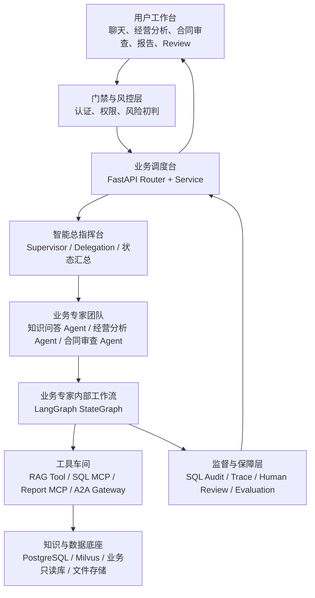
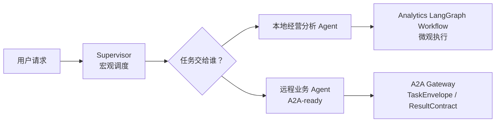
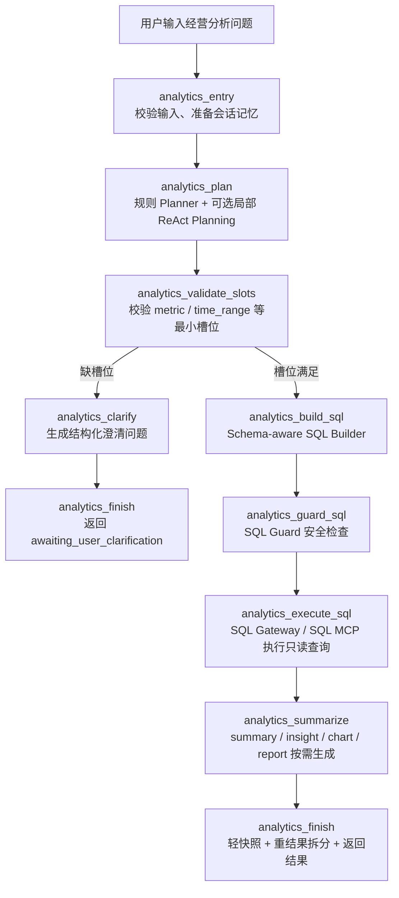
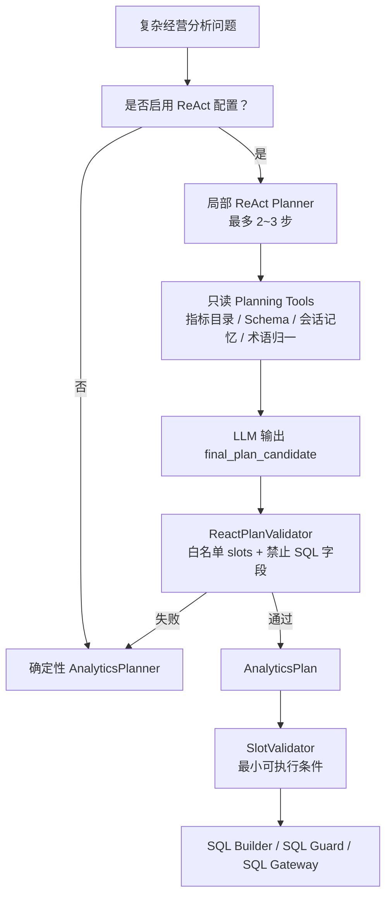
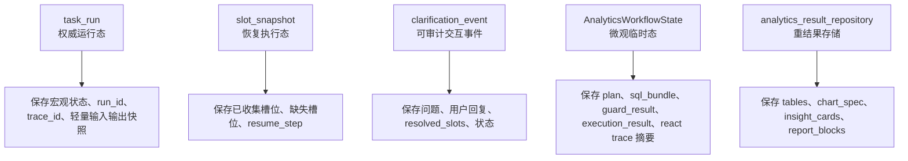
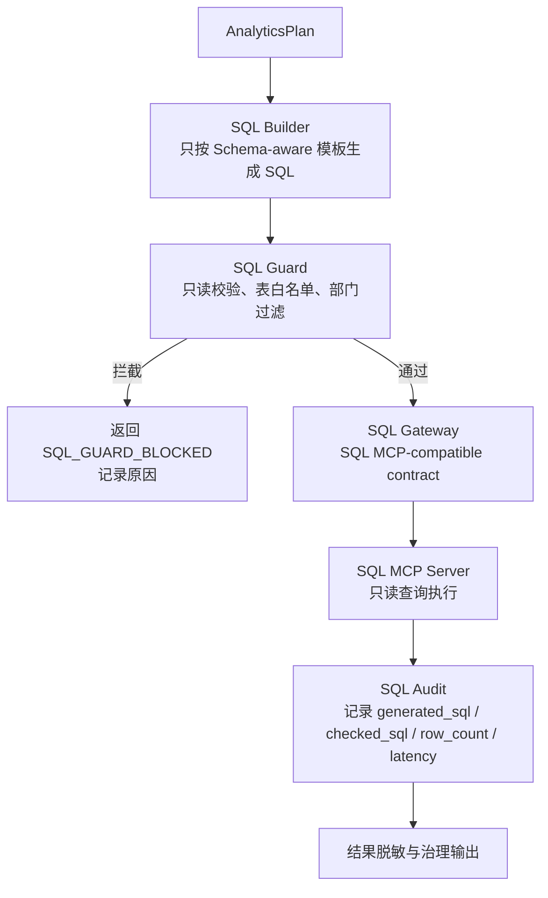

# 架构理念与流程图中文总览

## 1. 这份文档解决什么问题

这份文档是当前项目架构的中文导读版，目标是让不熟悉英文术语的人也能快速讲清楚：

- 这套系统为什么不是普通 RAG 问答；
- 为什么要采用 `Supervisor + 多业务 Agent + LangGraph Workflow + MCP/A2A`；
- 用户请求从进入系统到最终返回，完整经过哪些层；
- 经营分析为什么是 `StateGraph 受控主流程 + analytics_plan 局部 ReAct 子循环`；
- 哪些能力可以由 LLM 辅助，哪些必须由规则、权限、SQL Guard 和审计控制。

一句话概括当前架构：

```text
这是一个“治理优先、工作流优先、工具优先”的企业级 Agent 平台。
Supervisor 管任务交给谁，LangGraph 管业务专家内部怎么做，MCP/A2A 管能力和跨 Agent 协作边界。
```

---

## 2. 核心理念

### 2.1 Workflow-first：先工作流，再智能生成

企业场景不能只靠模型自由发挥。系统必须明确：

- 当前任务处于什么状态；
- 缺什么信息；
- 是否需要澄清；
- 是否需要 Human Review；
- 是否可以恢复执行；
- 每一步是否可审计。

因此本项目采用 **状态机 + 工作流**，而不是“用户输入直接丢给大模型”。

### 2.2 Tool-first：Agent 负责规划，工具负责执行

Agent 不直接访问数据库、不直接执行 SQL、不直接写外部系统。

真正执行动作必须经过：

- Tool Registry；
- MCP Gateway；
- SQL Guard；
- 权限校验；
- 审计记录。

这保证了系统可控、可追踪、可替换。

### 2.3 Governance-first：先治理，再执行

经营分析、合同审查、安全生产等企业场景都存在风险。

系统必须先判断：

- 用户有没有权限；
- 数据源能不能访问；
- 指标是否敏感；
- SQL 是否安全；
- 是否需要人工复核。

所以治理不是后补能力，而是主链路的一部分。

### 2.4 Evidence-first：答案要有依据

知识问答要有文档引用；经营分析要有 SQL 审计；报告要能追溯数据来源。

系统不能编造制度、安全规程、合同条款或经营数据。

---

## 3. 总体分层图



中文说明：

- **用户工作台**：用户真正操作的入口；
- **门禁与风控层**：先确认谁在访问、能不能做；
- **业务调度台**：API 和 Service 负责接请求、调业务；
- **智能总指挥台**：Supervisor 决定任务交给哪个专家；
- **业务专家团队**：不同业务有不同专家，不做一个万能 Agent；
- **业务专家内部工作流**：每个专家内部用 LangGraph 显式拆节点；
- **工具车间**：所有外部能力通过 Tool/MCP/A2A 边界调用；
- **知识与数据底座**：保存文档、向量、状态、审计和经营数据；
- **监督与保障层**：负责审核、审计、评估和追踪。

---

## 4. A2A 和 LangGraph 的关系



核心结论：

- **A2A 管谁来做**：本地专家还是远程专家；
- **LangGraph 管怎么做**：专家内部拆成哪些节点、如何流转；
- A2A 不替代 LangGraph；
- LangGraph 不替代 A2A。

---

## 5. 经营分析主流程



关键边界：

- `analytics_plan` 可以用 LLM 做复杂问题规划；
- LLM 只能产出结构化 plan candidate；
- SQL 必须由 `SQL Builder` 生成；
- SQL 必须经过 `SQL Guard`；
- SQL 执行必须经过 `SQL Gateway / SQL MCP`；
- 缺槽位是可恢复中间态，不是失败。

---

## 6. 局部 ReAct Planning 的安全边界

当前项目不是纯 ReAct。



ReAct 允许做：

- 指标候选判断；
- 维度选择建议；
- 同比 / 环比 / 排名等复杂意图拆解；
- 多轮上下文中的槽位补强建议。

ReAct 不允许做：

- 生成 SQL；
- 执行 SQL；
- 绕过 SQL Guard；
- 写 `task_run`；
- 触发 export；
- 触发 review；
- 覆盖权限判断；
- 修改治理结果。

---

## 7. 状态与持久化边界



设计原则：

- `task_run` 不能变成大 JSON 垃圾桶；
- 可恢复的槽位信息放 `slot_snapshot`；
- 澄清问答过程放 `clarification_event`；
- 执行期中间对象只留在 `workflow state`；
- 大结果放 `analytics_result_repository`。

---

## 8. MCP / SQL 安全执行流程



关键点：

- 经营分析不是自由 NL2SQL；
- LLM 不直接生成可执行 SQL；
- SQL Guard 阻断不能通过重试绕过；
- 所有 SQL 执行都要有审计。

---

## 9. 文档阅读顺序建议

如果你要讲项目，建议按这个顺序读：

1. `docs/ARCHITECTURE_FLOW_GUIDE_CN.md`：先看中文总览和流程图；
2. `docs/ARCHITECTURE.md`：看完整系统架构；
3. `docs/AGENT_WORKFLOW.md`：看工作流、状态、澄清和恢复；
4. `docs/PROJECT_STRUCTURE.md`：看代码目录怎么对应架构；
5. `docs/TECH_SELECTION.md`：看为什么选这些技术；
6. `docs/DB_DESIGN.md`：看数据库和状态持久化；
7. `docs/API_DESIGN.md`：看接口契约和状态返回。

---

## 10. 面试或汇报时的一句话讲法

可以这样讲：

```text
这个项目不是一个简单聊天机器人，而是一个企业级 Agent 平台。
上层由 Supervisor 做宏观调度，中间由不同业务 Agent 负责专业任务，
每个业务 Agent 内部用 LangGraph StateGraph 做受控执行。
外部能力通过 MCP/A2A 网关接入，经营分析 SQL 必须经过 SQL Builder、SQL Guard 和 SQL Gateway。
LLM 只做语义理解和局部 planning 增强，不直接执行高风险动作。
```
