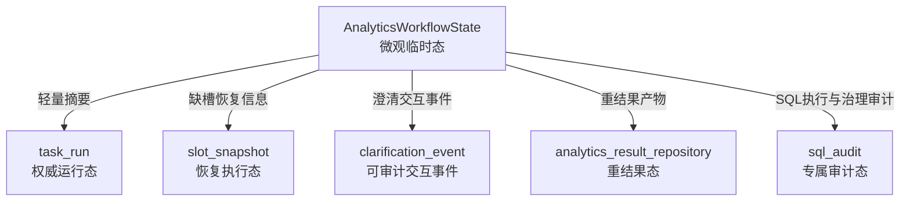

# SUPERVISOR_ANALYTICS_PERSISTENCE_BOUNDARY.md

# Supervisor + Analytics 子 Agent 持久化边界说明

---

## 1. 文档定位

本文档专门说明在 **Supervisor 宏观调度 + Analytics 子 Agent 微观执行** 模式下，
哪些状态应该进入权威持久化层，哪些状态只应该留在单次 workflow 执行上下文里。

这份文档重点解决五个问题：

1. `task_run` 到底保存什么
2. `slot_snapshot` 到底保存什么
3. `clarification_event` 到底保存什么
4. `analytics_result_repository` 到底保存什么
5. `AnalyticsWorkflowState` 到底哪些字段只属于微观临时态

---

## 2. 三层分工原则

本项目当前把经营分析运行态拆成三层，再加一个重结果层：

1. **权威运行态**
   - 面向跨请求恢复、跨层观测、跨系统审计；
   - 由 `task_run` 承担。

2. **恢复执行态**
   - 面向 clarification 补槽、用户补充后恢复执行；
   - 由 `slot_snapshot` 和 `clarification_event` 承担。

3. **微观临时态**
   - 面向单次 LangGraph workflow 内部节点流转；
   - 由 `AnalyticsWorkflowState` 承担。

4. **重结果态**
   - 面向表格、图表、洞察、报告块等大对象结果；
   - 由 `analytics_result_repository / analytics_results` 承担。

一句话记忆：

- `task_run` 负责“任务现在总体怎么样”
- `slot_snapshot / clarification_event` 负责“怎么恢复执行”
- `workflow state` 负责“当前节点内部怎么跑”
- `analytics_result_repository` 负责“最终大结果放哪里”

---

## 3. task_run：权威运行态

### 3.1 必须保留的字段

`task_run` 当前应重点保存以下字段：

- `run_id`
- `task_id`
- `parent_task_id`
- `conversation_id`
- `user_id`
- `trace_id`
- `task_type`
- `route`
- `selected_agent`
- `selected_capability`
- `risk_level`
- `review_status`
- `status`
- `sub_status`
- `error_code`
- `error_message`
- `started_at`
- `finished_at`
- `created_at`
- `updated_at`
- `retry_count`

### 3.2 input_snapshot 的定位

`input_snapshot` 只保存轻量输入快照，例如：

- `query`
- `output_mode`
- `need_sql_explain`
- `planner_slots`
- `planning_source`
- `confidence`

它不应该保存：

- `sql_bundle`
- `execution_result`
- `tables`
- `chart_spec`

### 3.3 output_snapshot 的定位

`output_snapshot` 只保存轻量输出快照，例如：

- `summary`
- `slots`
- `sql_preview`
- `row_count`
- `latency_ms`
- `compare_target`
- `group_by`
- `metric_scope`
- `data_source`
- `governance_decision` 的简版摘要
- `timing_breakdown`
- `has_heavy_result`

它明确 **不再承载**：

- `tables`
- `chart_spec`
- `insight_cards`
- `report_blocks`
- `execution_result` 全量 rows
- `sql_bundle`
- `plan`
- `guard_result`

### 3.4 为什么 task_run 不能变成“大对象垃圾桶”

原因有四个：

1. `task_run` 是权威运行态主表，读写频率高；
2. 如果把微观大对象全塞进去，主表 JSON 会快速膨胀；
3. 会影响 run detail、任务列表、状态轮询等常见路径；
4. 会模糊“运行状态”和“执行产物”的边界。

---

## 4. slot_snapshot：恢复执行态

`slot_snapshot` 只服务 **补槽恢复执行**。

### 4.1 应保存的字段

- `required_slots`
- `collected_slots`
- `missing_slots`
- `min_executable_satisfied`
- `awaiting_user_input`
- `resume_step`

### 4.2 不应保存的字段

- `tables`
- `chart_spec`
- `report_blocks`
- `execution_result`
- `sql_bundle`
- 任意 workflow 微观节点大对象

### 4.3 设计语义

`slot_snapshot` 不是通用状态表，也不是 `task_run` 的扩展 JSON。

它的职责很单一：

- 当前缺哪些槽位
- 用户补完后从哪一步恢复
- 是否已经满足最小可执行条件

---

## 5. clarification_event：可审计交互事件

`clarification_event` 负责记录系统和用户之间围绕“补槽”发生的交互事件。

### 5.1 应保存的字段

- `clarification_id`
- `run_id`
- `conversation_id`
- `question_text`
- `target_slots`
- `user_reply`
- `resolved_slots`
- `status`
- `created_at`
- `resolved_at`

### 5.2 不应保存的字段

- `sql_bundle`
- `execution_result`
- `tables`
- `report_blocks`
- `chart_spec`

### 5.3 为什么它和 slot_snapshot 不同

- `slot_snapshot` 关注的是“当前恢复执行状态”
- `clarification_event` 关注的是“这次系统提问和用户回复的交互证据”

一个偏恢复控制，一个偏审计事件，不能混用。

---

## 6. analytics_result_repository：重结果态

`analytics_result_repository` 负责保存经营分析的大对象结果。

### 6.1 应保存的内容

- `tables`
- `chart_spec`
- `insight_cards`
- `report_blocks`
- `sql_explain`
- `audit_info`
- 治理相关重结果摘要

### 6.2 为什么这些内容不留在 task_run.output_snapshot

因为这些内容具备三个典型特征：

1. **体积大**
2. **读取频率低于任务主状态**
3. **更偏结果产物，而不是运行状态**

因此更适合单独放在 `analytics_result_repository / analytics_results` 中按需读取。

---

## 7. AnalyticsWorkflowState：微观临时态

`AnalyticsWorkflowState` 负责经营分析 LangGraph workflow 的单次执行上下文。

### 7.1 典型微观临时态字段

- `workflow_stage`
- `workflow_outcome`
- `next_step`
- `plan`
- `metric_definition`
- `data_source_definition`
- `table_definition`
- `permission_check_result`
- `data_scope_result`
- `sql_bundle`
- `guard_result`
- `execution_result`
- `audit_record`
- `masking_result`
- `timing`

### 7.2 为什么这些字段通常不直接落 task_run

因为这些字段都符合以下一个或多个特征：

1. 只在当前 workflow 节点之间流转；
2. 当前节点结束后即可丢弃；
3. 大对象或高频中间态，不适合作为主表权威字段；
4. 已经有更合适的专属持久化位置，例如 `sql_audit`、`analytics_results`。

### 7.3 哪些字段会以“摘要形式”进入权威存储

虽然微观状态本身不直接落库，但少量摘要会进入权威持久化层，例如：

- `summary`
- `slots`
- `sql_preview`
- `timing_breakdown`
- `missing_slots`
- `clarification_type`

这类摘要适合进入：

- `task_run.output_snapshot`
- `task_run.context_snapshot`
- `slot_snapshot`
- `clarification_event`

---

## 8. Mermaid 分层图

---

## 9. 边界检查清单

后续开发如果新增字段，建议先问四个问题：

1. 这个字段是否需要跨请求恢复？
2. 这个字段是否需要跨层观测或跨系统审计？
3. 这个字段是否只是当前 workflow 节点内部临时态？
4. 这个字段是否属于重结果产物？

推荐判断：

- 如果答案偏 1/2：优先考虑 `task_run / slot_snapshot / clarification_event / sql_audit`
- 如果答案偏 3：优先留在 `workflow state`
- 如果答案偏 4：优先放 `analytics_result_repository`

---

## 10. 当前阶段结论

当前经营分析链路的持久化分层已经明确：

- `task_run`：权威运行态
- `slot_snapshot / clarification_event`：恢复执行态
- `workflow state`：微观临时态
- `analytics_result_repository`：重结果态

这意味着后续继续做：

- clarification 恢复执行
- review 通过后恢复
- 远程委托等待回传

都可以在不破坏主表边界的前提下继续演进。
