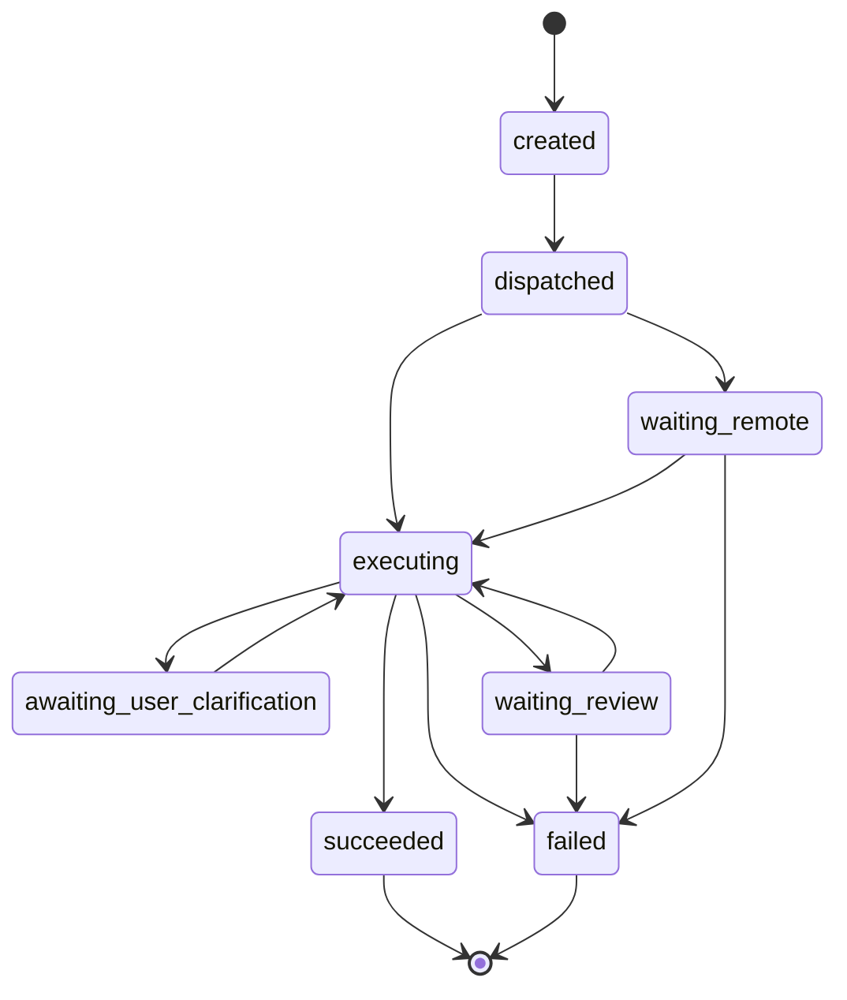
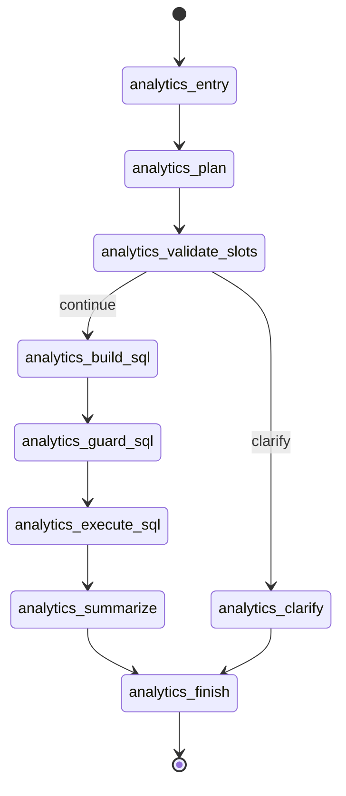

# SUPERVISOR_ANALYTICS_STATE_MACHINE.md

# Supervisor Agent 与 Analytics 子 Agent 双层状态机说明

---

## 1. 文档定位

本文档专门说明本项目在“Supervisor 宏观调度 + Analytics 子 Agent 微观执行”场景下的双层状态机设计。

这份文档解决三个问题：

1. **Supervisor 管什么状态**
2. **Analytics 子 Agent 管什么状态**
3. **两层状态如何映射**

---

## 2. 核心原则

### 2.1 不做一套混乱的大一统状态机

本项目明确反对把以下内容混在一套状态字符串里：

- 宏观任务生命周期
- 经营分析内部 SQL 阶段
- clarification / review / waiting_remote 等中断态

原因是：

1. 宏观调度关注的是“任务生命周期”；
2. 微观 workflow 关注的是“经营分析内部怎么一步步执行”；
3. 两层职责不同，如果混成一套状态，后续恢复执行、审计和排查都会非常痛苦。

### 2.2 宏观层和微观层职责分离

- **Supervisor 宏观状态机**：只描述任务生命周期
- **Analytics 微观状态机**：只描述经营分析内部 workflow 阶段

一句话记忆：

- **Supervisor 只关心任务现在属于什么生命周期**
- **Analytics 子 Agent 只关心自己内部做到哪一步**

---

## 3. Supervisor 宏观状态机

### 3.1 主状态

当前 Supervisor 宏观主状态包括：

- `created`
- `dispatched`
- `executing`
- `awaiting_user_clarification`
- `waiting_remote`
- `waiting_review`
- `succeeded`
- `failed`
- `cancelled`
- `expired`

### 3.2 子状态

当前 Supervisor 宏观子状态包括：

- `routing`
- `delegating_local`
- `delegating_remote`
- `collecting_result`
- `awaiting_remote_result`
- `awaiting_reviewer`
- `awaiting_user_input`
- `terminal_failure`

### 3.3 设计含义

Supervisor 层有两个硬约束：

1. 不出现 `analytics_build_sql / analytics_guard_sql / analytics_execute_sql` 这类业务内部细节；
2. clarification / review / remote 都被视为**标准中断态**，不是失败态。

---

## 4. Analytics 子 Agent 微观状态机

### 4.1 微观阶段

当前经营分析 workflow 阶段包括：

- `analytics_entry`
- `analytics_plan`
- `analytics_validate_slots`
- `analytics_clarify`
- `analytics_build_sql`
- `analytics_guard_sql`
- `analytics_execute_sql`
- `analytics_summarize`
- `analytics_finish`

### 4.2 微观结果方向

当前经营分析 workflow 结果方向包括：

- `continue`
- `clarify`
- `review`
- `finish`
- `fail`

### 4.3 关键字段

`AnalyticsWorkflowState` 当前至少承载：

- `query`
- `user_context`
- `conversation_id`
- `run_id`
- `trace_id`
- `workflow_stage`
- `workflow_outcome`
- `next_step`
- `clarification_needed`
- `review_required`
- `plan`
- `sql_bundle`
- `guard_result`
- `execution_result`
- `summary`
- `final_response`

这些字段的分层很明确：

- 输入态：请求参数、用户上下文、会话标识
- 中间态：plan / sql_bundle / execution_result / masking_result
- 输出态：summary / analytics_result / final_response

需要特别说明的是：

- 当前这些微观状态字段已经正式运行在 `LangGraph StateGraph` 上；
- 但当前仍然 **不接 checkpoint**；
- clarification / review / export 等中断恢复继续由业务状态机承担，而不是由 LangGraph checkpointer 承担。

这样设计的原因是：

1. 当前经营分析的恢复点相对固定；
2. `task_run / slot_snapshot / clarification_event / review_task / export_task` 已经足够表达恢复语义；
3. 直接 checkpoint 容易把 `plan / sql_bundle / execution_result` 等微观大对象一起序列化，破坏持久化边界。

---

## 5. 两层状态映射关系

### 5.1 映射原则

宏观层永远不要直接暴露微观节点名。

因此，需要单独的状态映射层把 Analytics 微观状态转换为 Supervisor 宏观状态。

### 5.2 当前映射规则

- `analytics_plan / analytics_build_sql / analytics_guard_sql / analytics_execute_sql / analytics_summarize`
  -> `executing`
- `analytics_clarify` 或 `workflow_outcome=clarify`
  -> `awaiting_user_clarification`
- `review_required=True` 或 `workflow_outcome=review`
  -> `waiting_review`
- `analytics_finish + workflow_outcome=finish`
  -> `succeeded`
- `workflow_outcome=fail`
  -> `failed`

### 5.3 为什么 clarification 不是 failed

因为 clarification 的真实语义是：

- 当前任务缺少必要输入；
- 任务还可以继续；
- 用户补完信息后可恢复执行。

所以它是**可恢复中间态**，不是失败态。

### 5.4 为什么 review 是标准中断态

因为 review 的真实语义是：

- 当前流程被治理策略主动暂停；
- 审核通过可继续；
- 审核拒绝才终止。

所以它也不能被混成 succeeded 或 failed。

---

## 6. 中断态与恢复语义

### 6.1 clarification

`awaiting_user_clarification` 是标准可恢复中间态。

恢复依赖：

- `run_id`
- `trace_id`
- `conversation_id`
- `slot_snapshot`
- `clarification_event`

### 6.2 waiting_review

`waiting_review` 是标准审核等待态。

恢复依赖：

- `run_id`
- `review_id`
- `review_status`

### 6.3 waiting_remote

`waiting_remote` 是标准远程委托等待态。

恢复依赖：

- `run_id`
- `trace_id`
- `parent_task_id`
- 远程结果回传契约

---

## 7. Mermaid 状态图

### 7.1 Supervisor 宏观状态图

### 7.2 Analytics 微观状态图

---

## 8. 当前实现落点

当前实现对应代码位置：

- `core/agent/supervisor/status.py`
- `core/agent/supervisor/supervisor_service.py`
- `core/agent/supervisor/delegation_controller.py`
- `core/agent/workflows/analytics/state.py`
- `core/agent/workflows/analytics/nodes.py`
- `core/agent/workflows/analytics/graph.py`
- `core/agent/workflows/analytics/status_mapper.py`
- `core/agent/workflows/analytics/adapter.py`

---

## 9. 当前阶段结论

到这一轮为止，项目已经把：

- **宏观任务生命周期**
- **微观经营分析 workflow 阶段**
- **clarification / review / waiting_remote 中断态**
- **run_id / trace_id 透传**

这四件事拆清楚了。

这意味着后续继续做：

- clarification 恢复执行
- review 后恢复
- 真远程 A2A 结果回传

时，不需要再回头大改状态模型。 
